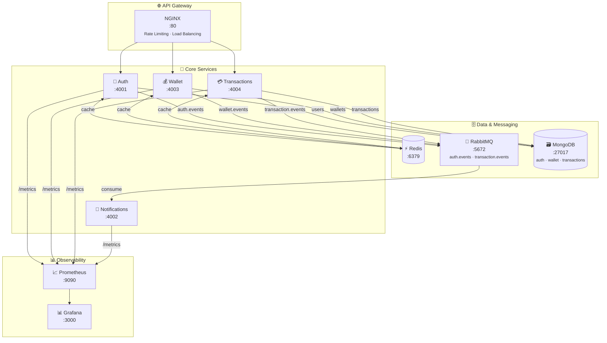
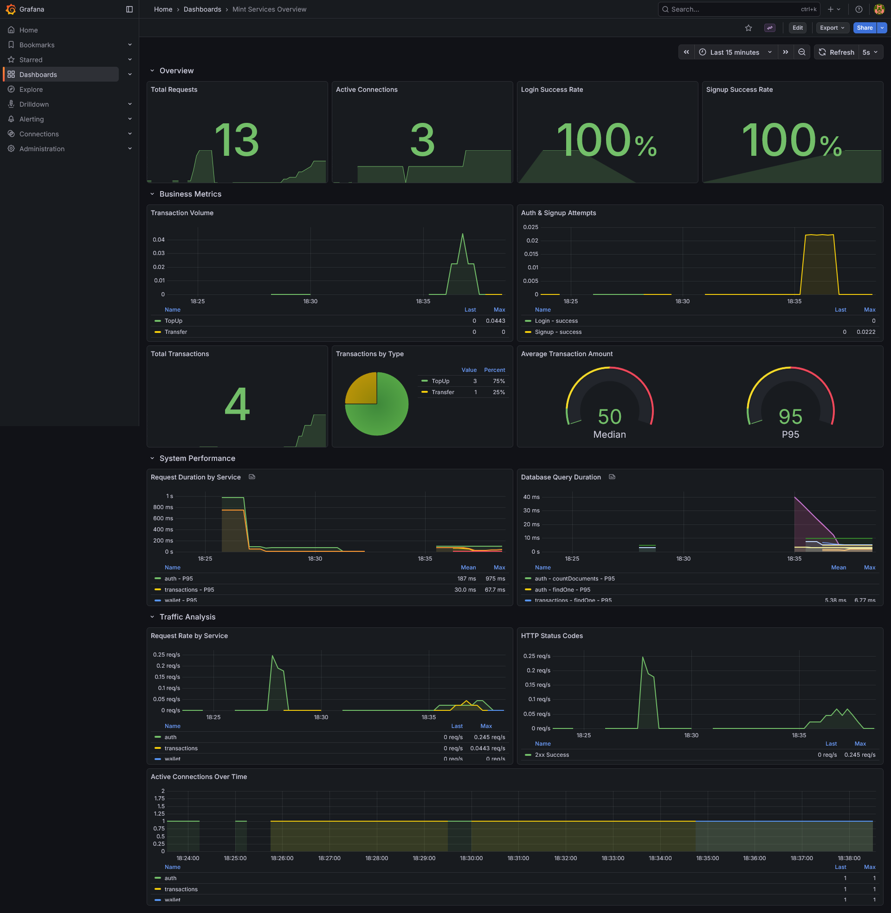

<div align="center">

# Mint - Event-Driven Wallet Microservices


[](https://nodejs.org)
[](https://www.typescriptlang.org/)
[](https://www.rabbitmq.com/)
[](https://www.mongodb.com/)
[](https://www.docker.com/)
[](https://vitest.dev/)
[](https://sreekarnv.github.io/mint/)
[](LICENSE)

**A production-ready, event-driven microservices wallet system featuring secure authentication, real-time transaction processing, and automated notifications.**

[**📖 Documentation**](https://sreekarnv.github.io/mint/) • [API Reference](https://sreekarnv.github.io/mint/api/auth/) • [Quick Start](#-quick-start) • [Architecture](#-architecture)

</div>

---

## Overview

Mint is a modern wallet platform built with microservices architecture and event-driven communication. It demonstrates production-ready patterns including JWT authentication, distributed transactions, message queuing, and API gateway design.

---

## 🛠️ Tech Stack

<p align="left">
  <a href="https://nodejs.org/" target="_blank">
    
  </a>
  <a href="https://expressjs.com/" target="_blank">
    
  </a>
  <a href="https://www.typescriptlang.org/" target="_blank">
    
  </a>
  <a href="https://www.mongodb.com/" target="_blank">
    
  </a>
  <a href="https://www.rabbitmq.com/" target="_blank">
    
  </a>
  <a href="https://redis.io/" target="_blank">
    
  </a>
  <a href="https://www.nginx.com/" target="_blank">
    
  </a>
  <a href="https://prometheus.io/" target="_blank">
    
  </a>
  <a href="https://grafana.com/" target="_blank">
    
  </a>
  <a href="https://www.docker.com/" target="_blank">
    
  </a>
</p>


---

## Features

- **🔐 Secure Authentication**: JWT (RS256) with JWKS, Argon2 password hashing, HTTP-only cookies
- **💰 Wallet Management**: Event-driven wallet creation, real-time balance updates, transaction history
- **🔁 Transaction Processing**: Top-ups and transfers with PENDING → PROCESSING → COMPLETED/FAILED states
- **📨 Smart Notifications**: Automated emails for signups and transactions via RabbitMQ consumers
- **⚡ Redis Caching**: Cache-aside pattern with 80-90% hit rates for frequently accessed data
- **📊 Observability**: Prometheus metrics + Grafana dashboards for real-time monitoring
- **📝 API Documentation**: OpenAPI/Swagger documentation for all endpoints
- **🔗 API Gateway**: NGINX reverse proxy with rate limiting, health checks, and load balancing
- **🏗️ Microservices Design**: Independent services, database-per-service pattern, horizontal scalability
- **✅ Comprehensive Testing**: 112 tests with unit, integration, and consumer coverage

---

## Architecture



**Communication Patterns**:
- **Client → Services**: HTTP/REST via NGINX Gateway
- **Service → Service**: Asynchronous events via RabbitMQ
- **Event Flow**: No direct service-to-service HTTP calls

📖 [Detailed Architecture Guide](https://sreekarnv.github.io/mint/architecture/) • [Event Flows](https://sreekarnv.github.io/mint/events/)

---

## Quick Start

### Prerequisites

- Docker (v20.10+) & Docker Compose (v2.0+)
- Git

### Installation

```bash
# 1. Clone the repository
git clone https://github.com/sreekarnv/mint.git
cd mint

# 2. Set up environment files
cp auth/.env.example auth/.env.docker
cp wallet/.env.example wallet/.env.docker
cp transactions/.env.example transactions/.env.docker
cp notifications/.env.example notifications/.env.docker

# 3. Generate RSA keys for JWT
cd auth/keys
openssl genrsa -out private_key.pem 2048
openssl rsa -in private_key.pem -pubout -out public_key.pem
cd ../..

# 4. Start all services
docker compose up --build
```

### Verify Installation

```bash
# Check gateway health
curl http://localhost/health

# View running services
docker compose ps
```

**Access Points**:
- API Gateway: http://localhost
- Swagger Documentation: http://localhost/api-docs (Auth service)
- RabbitMQ Management: http://localhost:15672 (guest/guest)
- Prometheus Metrics: http://localhost:9090
- Grafana Dashboards: http://localhost:3000 (admin/admin)
- MongoDB: mongodb://localhost:27017
- Redis: redis://localhost:6379

📖 [Detailed Setup Guide](https://sreekarnv.github.io/mint/getting-started/installation/) • [Configuration](https://sreekarnv.github.io/mint/getting-started/configuration/)

---

## Services

| Service | Port | Description | Documentation |
|---------|------|-------------|---------------|
| **Auth** | 4001 | User authentication, JWT, JWKS, user management | [Docs](https://sreekarnv.github.io/mint/services/auth/) |
| **Wallet** | 4003 | Wallet creation, balance management, event consumers | [Docs](https://sreekarnv.github.io/mint/services/wallet/) |
| **Transactions** | 4004 | Top-ups, transfers, transaction orchestration | [Docs](https://sreekarnv.github.io/mint/services/transactions/) |
| **Notifications** | 4002 | Email notifications via RabbitMQ events | [Docs](https://sreekarnv.github.io/mint/services/notifications/) |
| **API Gateway** | 80 | NGINX reverse proxy, rate limiting, routing | [Docs](https://sreekarnv.github.io/mint/architecture/#api-gateway) |

📖 [API Reference](https://sreekarnv.github.io/mint/api/auth/) • [Service Details](https://sreekarnv.github.io/mint/services/auth/)

---

## API Examples

### Authentication

```bash
# Register
curl -X POST http://localhost/api/v1/auth/signup \
  -H "Content-Type: application/json" \
  -d '{"name": "John Doe", "email": "john@example.com", "password": "SecurePass123!"}'

# Login
curl -X POST http://localhost/api/v1/auth/login \
  -H "Content-Type: application/json" \
  -d '{"email": "john@example.com", "password": "SecurePass123!"}' \
  -c cookies.txt
```

### Transactions

```bash
# Top-up wallet
curl -X POST http://localhost/api/v1/transactions/topup \
  -H "Content-Type: application/json" \
  -b cookies.txt \
  -d '{"amount": 100.00, "description": "Adding funds"}'

# Transfer funds
curl -X POST http://localhost/api/v1/transactions/transfer \
  -H "Content-Type: application/json" \
  -b cookies.txt \
  -d '{"recipientId": "507f1f77bcf86cd799439011", "amount": 50.00, "description": "Payment"}'
```

📖 [Complete API Documentation](https://sreekarnv.github.io/mint/api/auth/)

---

## Development

```bash
# Run in development mode with hot-reload
docker compose -f docker-compose.dev.yml up --build

# View logs for a specific service
docker compose logs -f auth

# Access MongoDB
docker exec -it mint-mongodb mongosh -u root -p example

# Access RabbitMQ UI
open http://localhost:15672
```

📖 [Development Guide](https://sreekarnv.github.io/mint/development/) • [Troubleshooting](https://sreekarnv.github.io/mint/troubleshooting/)

---

## Testing

Mint includes comprehensive test coverage (112 tests) using Vitest, Supertest, and MongoDB Memory Server.

```bash
# Run all tests across all services
pnpm test

# Run tests for a specific service
pnpm test:auth
pnpm test:wallet
pnpm test:transactions
pnpm test:notifications

# Run tests in watch mode
pnpm test:watch

# Generate coverage reports
pnpm test:coverage
```

**Test Types**:
- **Unit Tests**: Service logic, models, utilities (59 tests)
- **Integration Tests**: API endpoints with Supertest (45 tests)
- **Consumer Tests**: RabbitMQ event handlers (8 tests)
- **Mock Tests**: External dependencies (RabbitMQ, email)

**Coverage Metrics**:
- **Auth**: 35 tests, 59.31% coverage
- **Wallet**: 20 tests, 50.25% coverage
- **Transactions**: 44 tests, 63.41% coverage
- **Notifications**: 13 tests, 15.91% coverage

All tests passing | CI/CD integrated

📖 [Testing Guide](https://sreekarnv.github.io/mint/testing/)

---

## Project Structure

```
mint/
├── auth/              # Authentication Service
├── wallet/            # Wallet Service
├── transactions/      # Transactions Service
├── notifications/     # Notifications Service
├── nginx/             # API Gateway Configuration
├── docs/              # Documentation (MkDocs)
├── docker-compose.yml # Production setup
└── docker-compose.dev.yml # Development setup
```

---

## 📊 Monitoring & Observability

Mint includes a complete observability stack with Prometheus and Grafana for real-time monitoring and alerting.

<div align="center">
  
  <p><em>Real-time Grafana dashboard showing service metrics, cache performance, and system health</em></p>
</div>

**Metrics Collected**:
- **HTTP Metrics**: Request duration, total requests, active connections, status codes
- **Database Metrics**: Query duration by operation and collection, connection pool stats
- **Cache Metrics**: Hit/miss rates, cache errors, performance by key prefix
- **Transaction Metrics**: Transaction counts by type/status, amount distribution
- **RabbitMQ Metrics**: Message rates, queue depths, consumer lag
- **System Metrics**: CPU, memory, network I/O (via Node.js)

**Access Monitoring**:
```bash
# Prometheus metrics
curl http://localhost:9090

# Grafana dashboards
open http://localhost:3000
# Login: admin/admin
```

**Key Performance Indicators**:
- Cache Hit Rate: **80-90%** for user data and transactions
- API Response Time: **p95 < 100ms**, p99 < 200ms
- Transaction Processing: **<2s** end-to-end latency
- Service Uptime: **99.9%+** availability

📖 [Monitoring Guide](https://sreekarnv.github.io/mint/monitoring/)

---

## Documentation

Comprehensive documentation is available at **[sreekarnv.github.io/mint](https://sreekarnv.github.io/mint/)**

**Quick Links**:
- [Installation Guide](https://sreekarnv.github.io/mint/getting-started/installation/)
- [Architecture Overview](https://sreekarnv.github.io/mint/architecture/)
- [Event Flows](https://sreekarnv.github.io/mint/events/)
- [API Reference](https://sreekarnv.github.io/mint/api/auth/)
- [Service Documentation](https://sreekarnv.github.io/mint/services/auth/)
- [Troubleshooting](https://sreekarnv.github.io/mint/troubleshooting/)
- [Contributing Guide](https://sreekarnv.github.io/mint/about/contributing/)

---

## License

This project is licensed under the MIT License. See the [LICENSE](LICENSE) file for details.

---

## Author

**Sreekar Venkata Nutulapati**

[](https://github.com/sreekarnv)
[](https://in.linkedin.com/in/sreekar-venkata-nutulapati-63672120a)

---

<div align="center">

**Built with TypeScript, Node.js, RabbitMQ, MongoDB, and Docker**

⭐ Star this repository if you find it helpful!

</div>
