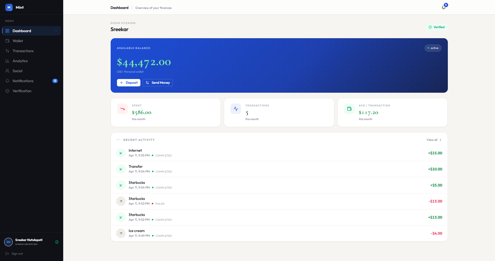
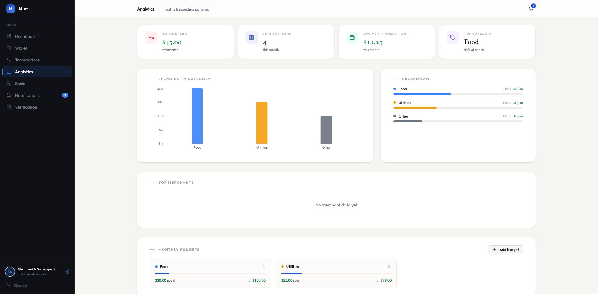
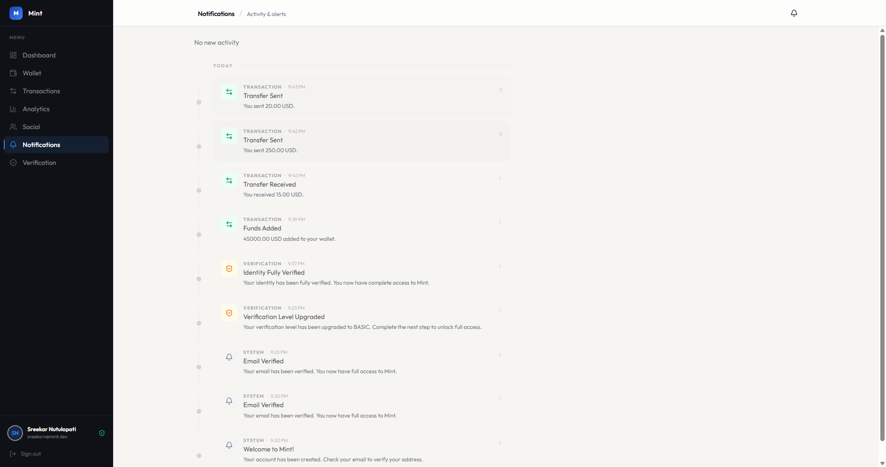
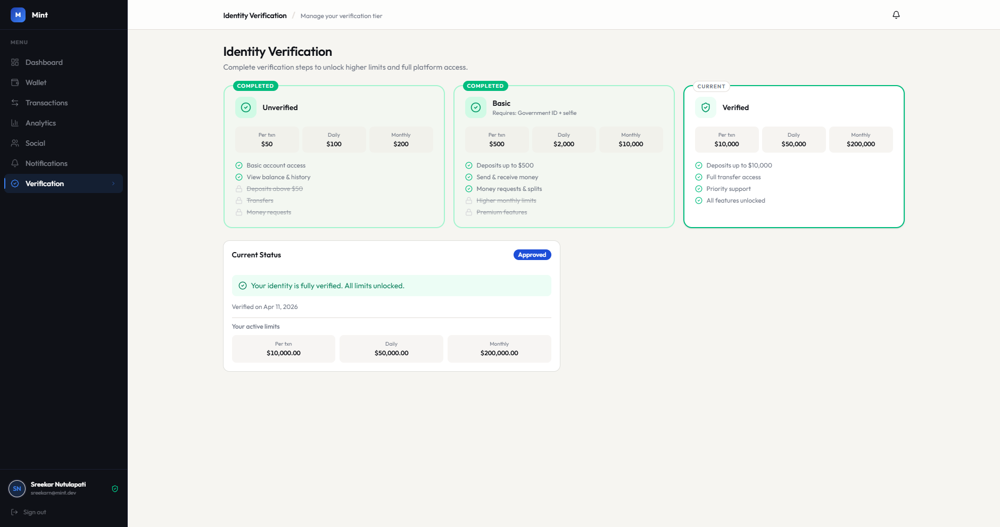
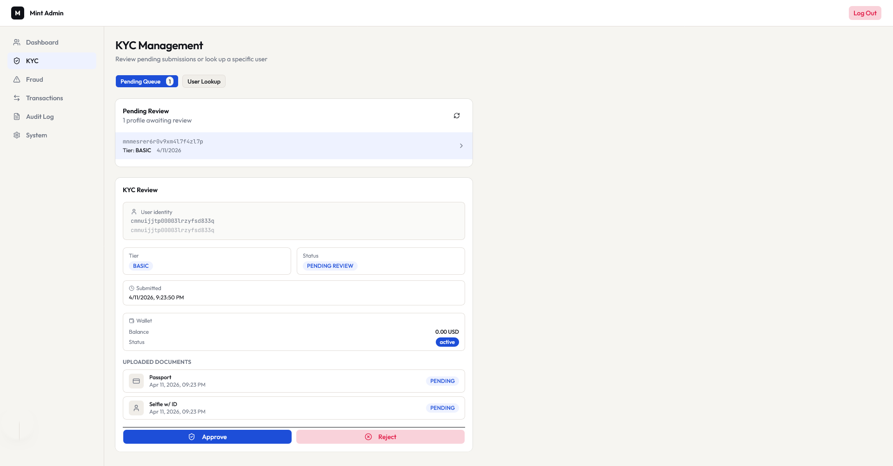

# Mint

A production-style fintech platform built as a polyglot microservices monorepo. Covers authentication, wallet management, payments, KYC, fraud detection, analytics, social features, webhooks, an admin console, and a tamper-proof audit log.

<p align="left">
  <a href="https://nestjs.com/" target="_blank">
    
  </a>
  <a href="https://fastapi.tiangolo.com/" target="_blank">
    
  </a>
  <a href="https://www.typescriptlang.org/" target="_blank">
    
  </a>
  <a href="https://www.python.org/" target="_blank">
    
  </a>
  <a href="https://www.postgresql.org/" target="_blank">
    
  </a>
  <a href="https://kafka.apache.org/" target="_blank">
    
  </a>
  <a href="https://redis.io/" target="_blank">
    
  </a>
  <a href="https://grpc.io/" target="_blank">
    
  </a>
  <a href="https://min.io/" target="_blank">
    
  </a>
  <a href="https://opentelemetry.io/" target="_blank">
    
  </a>
  <a href="https://grafana.com/" target="_blank">
    
  </a>
  <a href="https://www.docker.com/" target="_blank">
    
  </a>
  <a href="https://www.prisma.io/" target="_blank">
    
  </a>
  <a href="https://www.nginx.com/" target="_blank">
    
  </a>
</p>

> Looking for the original version built with Express, MongoDB, RabbitMQ, and React? See the [v1 branch](https://github.com/sreekarnv/mint/tree/v1).

## Frontend

A Next.js 15 app serves both the user-facing product and the admin console through the same nginx gateway.

<table>
  <tr>
    <td align="center" width="50%">
      
      <br /><sub><b>Dashboard</b> — wallet balance, recent activity, quick deposit &amp; send</sub>
    </td>
    <td align="center" width="50%">
      
      <br /><sub><b>Analytics</b> — category spend, breakdown, top merchants, budget tracking</sub>
    </td>
  </tr>
  <tr>
    <td align="center" width="50%">
      
      <br /><sub><b>Notifications</b> — real-time activity feed via SSE</sub>
    </td>
    <td align="center" width="50%">
      
      <br /><sub><b>Identity Verification</b> — tier progression, document upload, active limits</sub>
    </td>
  </tr>
  <tr>
    <td align="center" colspan="2">
      
      <br /><sub><b>Admin — KYC Management</b> — pending review queue, document inspection, approve / reject</sub>
    </td>
  </tr>
</table>

## Services

| Service       | Stack              | Port | Description                                  |
| ------------- | ------------------ | ---- | -------------------------------------------- |
| web           | Next.js 15         | 3000 | User app and admin console                   |
| auth          | Python / FastAPI   | 4001 | JWT issuance, refresh, RBAC                  |
| wallet        | Python / FastAPI   | 4002 | Balances, gRPC settlement interface          |
| transactions  | NestJS             | 4003 | Transfers, top-ups, idempotency              |
| fraud         | NestJS (gRPC only) | —    | Real-time fraud scoring on every transaction |
| kyc           | NestJS             | 4004 | Document upload, tier management             |
| analytics     | NestJS             | 4005 | Spend insights, category budgets             |
| notifications | NestJS             | 4006 | Persistent notifications + SSE stream        |
| social        | NestJS             | 4007 | Contacts, money requests, bill splits        |
| webhook       | NestJS             | 4008 | User-registered webhooks + delivery log      |
| admin         | NestJS             | 4009 | Admin console API                            |
| audit         | NestJS             | 4010 | Immutable append-only audit log              |

## Running

```bash
# Generate RSA keys (first time only)
sh scripts/generate-keys.sh

# Start everything
docker compose -f docker-compose.dev.yml up -d --build
```

The app is at **http://localhost**. The admin console is at **http://localhost/app-admin**.

Create an admin user:

```bash
docker exec -it mint-auth uv run python /app/apps/auth/src/create_admin.py \
  --email admin@mint.dev \
  --password adminpass \
  --name "Admin User"
```

Migrations run automatically on startup. Swagger UI is at `/api-docs` on every service.

## Observability

Every service exports OpenTelemetry traces to a local collector. Trace context is propagated across HTTP, gRPC, and Kafka — a single transfer produces one trace spanning fraud scoring, wallet settlement, analytics ingestion, notification delivery, and webhook dispatch.

Grafana is at **http://localhost:4000**.


## Docs

Full documentation at [sreekarnv.github.io/mint](https://sreekarnv.github.io/mint).

- [Architecture](https://sreekarnv.github.io/mint/architecture/) — service map, communication patterns, auth flow, transfer flow
- [Design Decisions](https://sreekarnv.github.io/mint/design-decisions/) — polyglot rationale, gRPC vs Kafka, idempotency, fraud scoring, audit immutability
- [Services](https://sreekarnv.github.io/mint/services/) — endpoints, databases, Kafka topics per service
- [Infrastructure](https://sreekarnv.github.io/mint/infrastructure/) — nginx, Kafka, Postgres, Redis, MinIO, observability
- [Running](https://sreekarnv.github.io/mint/running/) — dev and production setup
