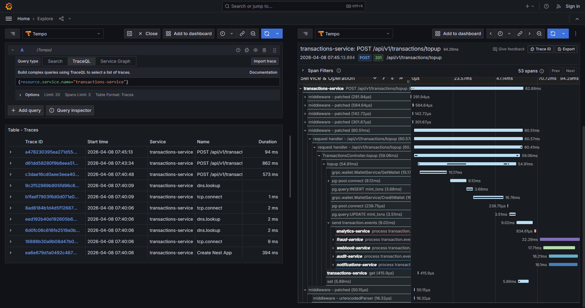

# Mint

A production-style fintech platform built with a microservices architecture. Covers authentication, wallet based payments, KYC, fraud detection, analytics, social features, webhooks, an admin console, and a tamper-proof audit log.

<p align="left">
  <a href="https://nestjs.com/" target="_blank">
    
  </a>
  <a href="https://fastapi.tiangolo.com/" target="_blank">
    
  </a>
  <a href="https://www.typescriptlang.org/" target="_blank">
    
  </a>
  <a href="https://www.python.org/" target="_blank">
    
  </a>
  <a href="https://www.postgresql.org/" target="_blank">
    
  </a>
  <a href="https://kafka.apache.org/" target="_blank">
    
  </a>
  <a href="https://redis.io/" target="_blank">
    
  </a>
  <a href="https://grpc.io/" target="_blank">
    
  </a>
  <a href="https://min.io/" target="_blank">
    
  </a>
  <a href="https://opentelemetry.io/" target="_blank">
    
  </a>
  <a href="https://grafana.com/" target="_blank">
    
  </a>
  <a href="https://www.docker.com/" target="_blank">
    
  </a>
  <a href="https://www.prisma.io/" target="_blank">
    
  </a>
  <a href="https://www.nginx.com/" target="_blank">
    
  </a>
</p>

## Docs

- [Architecture](docs/architecture.md) - service map, communication patterns, JWT flow
- [Services](docs/services.md) - each service: endpoints, DB, Kafka topics
- [Infrastructure](docs/infrastructure.md) - nginx, Kafka, Postgres, Redis, MinIO, observability
- [Running](docs/running.md) - dev and production setup

## Services

| Service       | Stack            | Port | Description                                   |
| ------------- | ---------------- | ---- | --------------------------------------------- |
| auth          | Python / FastAPI | 4001 | JWT issuance, refresh, RBAC                   |
| wallet        | Python / FastAPI | 4002 | gRPC settlement interface                     |
| transactions  | NestJS           | 4003 | Transfers, top-ups, idempotency               |
| fraud         | NestJS (gRPC)    | \*   | Real-time fraud scoring on every transaction  |
| kyc           | NestJS           | 4004 | Document upload, tier management              |
| analytics     | NestJS           | 4005 | Spend insights, category budgets              |
| notifications | NestJS           | 4006 | Persistent notifications + SSE stream         |
| social        | NestJS           | 4007 | Contacts, money requests, bill splits         |
| webhook       | NestJS           | 4008 | User-registered webhooks + delivery log       |
| admin         | NestJS           | 4009 | Admin console (user management, fraud review) |
| audit         | NestJS           | 4010 | Immutable append-only audit log               |

\* fraud is gRPC-only, called internally by the transactions service.

## Running

```bash
docker compose -f docker-compose.dev.yml up -d --build
```

### Admin User

Create an admin user in the auth service database.

```bash
docker exec -it mint-auth python /app/apps/auth/create_admin.py \
  --email admin@mint.dev \
  --password adminpass \
  --name "Admin User"
```

Migrations run automatically before each service starts. API docs are at `/api-docs` on every service.

## Observability

Every service ships OpenTelemetry traces to a local collector, stored in Tempo and visualised in Grafana at http://localhost:3000. Trace context is propagated across HTTP, gRPC, and Kafka so a single top-up request produces one trace spanning all downstream consumers.


