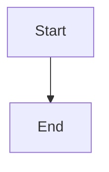

# Documentation Development

This directory contains the MkDocs documentation for Mint.

## Setup

### Install MkDocs

```bash
pip install mkdocs-material mkdocs-git-revision-date-localized-plugin
```

### Serve Locally

```bash
mkdocs serve
```

Then open http://localhost:8000 in your browser.

### Build

```bash
mkdocs build
```

The static site will be generated in `site/` directory.

## Deployment

Documentation is automatically deployed to GitHub Pages when you push to the `main` or `master` branch.

The deployment is handled by `.github/workflows/deploy-docs.yml`.

## Structure

```
docs/
├── index.md                 # Homepage
├── getting-started/
│   ├── installation.md      # Installation guide
│   ├── quick-start.md       # Quick start tutorial
│   └── configuration.md     # Configuration guide
├── architecture.md          # Architecture overview
├── events.md                # Event architecture
├── services/
│   ├── auth.md             # Auth service docs
│   ├── wallet.md           # Wallet service docs
│   ├── transactions.md     # Transactions service docs
│   └── notifications.md    # Notifications service docs
├── api/
│   ├── auth.md             # Auth API reference
│   ├── wallet.md           # Wallet API reference
│   └── transactions.md     # Transactions API reference
├── development.md           # Development guide
├── deployment.md            # Deployment guide
├── troubleshooting.md       # Troubleshooting guide
└── about/
    ├── license.md          # License
    └── contributing.md     # Contributing guidelines
```

## Writing Docs

### Admonitions

```markdown
!!! note
    This is a note

!!! warning
    This is a warning

!!! tip
    This is a tip

!!! success
    This is a success message
```

### Code Blocks

````markdown
```bash
docker compose up
```

```typescript
interface User {
  id: string;
  name: string;
}
```
````

### Mermaid Diagrams

````markdown

````

## Assets

Add logos and favicons to `docs/assets/`:

- `logo.svg` - Site logo
- `favicon.ico` - Browser favicon

## Navigation

Edit `mkdocs.yml` to modify the navigation structure.
