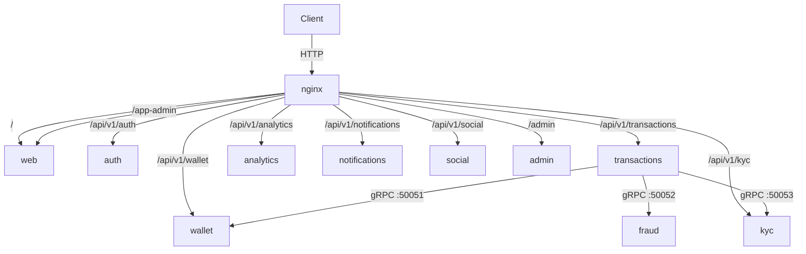
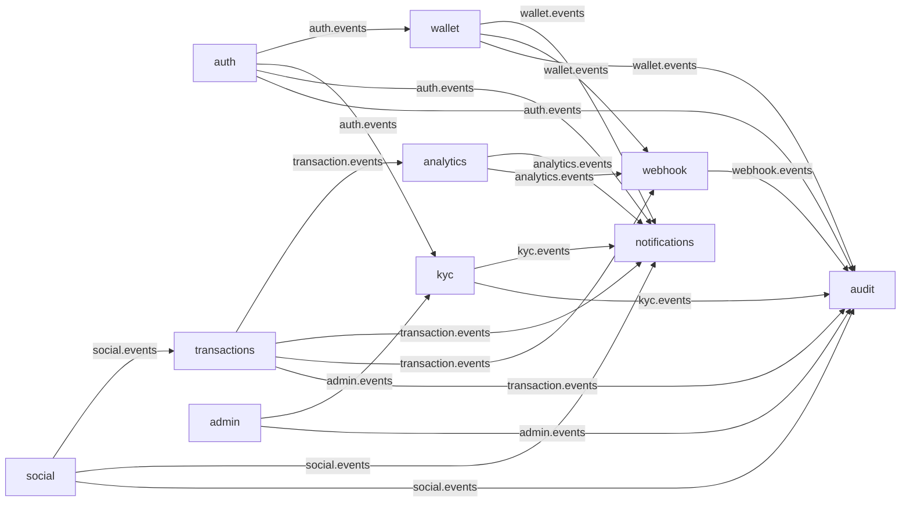
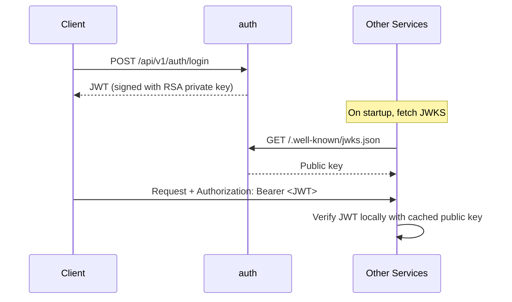
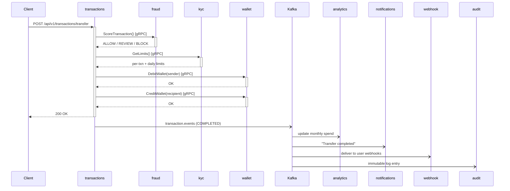
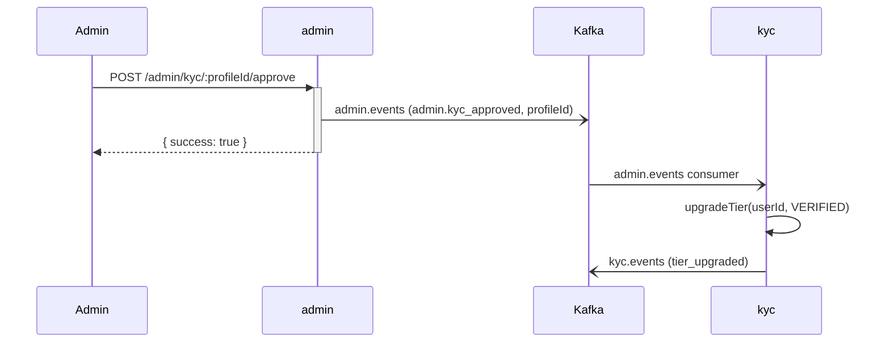

# Architecture

Mint is a polyglot microservices monorepo. 9 services are written in NestJS (TypeScript), 2 in FastAPI (Python), and the frontend is a Next.js 15 app. All services are independently deployable and communicate over HTTP (public), gRPC (synchronous internal), and Kafka (asynchronous internal).

## Service Map


```mermaid
graph TD
    Client -->|HTTP| nginx

    nginx -->|/| web
    nginx -->|/app-admin| web
    nginx -->|/api/v1/auth| auth
    nginx -->|/api/v1/wallet| wallet
    nginx -->|/api/v1/transactions| transactions
    nginx -->|/api/v1/kyc| kyc
    nginx -->|/api/v1/analytics| analytics
    nginx -->|/api/v1/notifications| notifications
    nginx -->|/api/v1/social| social
    nginx -->|/admin| admin

    transactions -->|gRPC :50052| fraud
    transactions -->|gRPC :50053| kyc
    transactions -->|gRPC :50051| wallet
```

## Communication Patterns

### Synchronous — gRPC

Used for blocking operations where the caller needs a result before proceeding.

| Caller | Target | Port | Purpose |
|--------|--------|------|---------|
| transactions | fraud | 50052 | Score every transaction before settlement |
| transactions | kyc | 50053 | Check per-transaction and daily/monthly limits |
| transactions | wallet | 50051 | Debit sender, credit recipient |
| admin | kyc | 50053 | Fetch KYC profile and pending queue |
| admin | wallet | 50051 | Fetch wallet status for user management |
| admin | fraud | 50052 | Fetch and action fraud cases |

### Asynchronous — Kafka

Used for fan-out side effects: audit logging, analytics, notifications, and cross-service reactions.


```mermaid
flowchart LR
    auth -->|auth.events| wallet
    auth -->|auth.events| kyc
    auth -->|auth.events| notifications
    auth -->|auth.events| audit

    wallet -->|wallet.events| notifications
    wallet -->|wallet.events| webhook
    wallet -->|wallet.events| audit

    transactions -->|transaction.events| analytics
    transactions -->|transaction.events| notifications
    transactions -->|transaction.events| webhook
    transactions -->|transaction.events| audit

    kyc -->|kyc.events| notifications
    kyc -->|kyc.events| audit

    social -->|social.events| transactions
    social -->|social.events| notifications
    social -->|social.events| audit

    analytics -->|analytics.events| notifications
    analytics -->|analytics.events| webhook

    admin -->|admin.events| kyc
    admin -->|admin.events| audit
    webhook -->|webhook.events| audit
```

## Auth / JWT Flow


```mermaid
sequenceDiagram
    participant Client
    participant auth
    participant Other Services

    Client->>auth: POST /api/v1/auth/login
    auth-->>Client: JWT (signed with RSA private key)

    Note over Other Services: On startup, fetch JWKS
    Other Services->>auth: GET /.well-known/jwks.json
    auth-->>Other Services: Public key

    Client->>Other Services: Request + Authorization: Bearer <JWT>
    Other Services->>Other Services: Verify JWT locally with cached public key
```

- JWT payload includes `sub` (user ID) and `role` claim.
- All services share `JWTAuthGuard` from `libs/common` for verification.
- The admin service additionally checks `role=ADMIN` on every request.

## Transfer Request Flow


```mermaid
sequenceDiagram
    participant Client
    participant transactions
    participant fraud
    participant kyc
    participant wallet
    participant Kafka

    Client->>+transactions: POST /api/v1/transactions/transfer
    transactions->>+fraud: ScoreTransaction() [gRPC]
    fraud-->>-transactions: ALLOW / REVIEW / BLOCK

    transactions->>+kyc: GetLimits() [gRPC]
    kyc-->>-transactions: per-txn + daily limits

    transactions->>+wallet: DebitWallet(sender) [gRPC]
    wallet-->>-transactions: OK

    transactions->>+wallet: CreditWallet(recipient) [gRPC]
    wallet-->>-transactions: OK

    transactions-->>-Client: 200 OK

    transactions-)Kafka: transaction.events (COMPLETED)
    Kafka-)analytics: update monthly spend
    Kafka-)notifications: "Transfer completed"
    Kafka-)webhook: deliver to user webhooks
    Kafka-)audit: immutable log entry
```

## KYC Approval Flow


```mermaid
sequenceDiagram
    participant Admin
    participant admin
    participant Kafka
    participant kyc

    Admin->>+admin: POST /admin/kyc/:profileId/approve
    admin-)Kafka: admin.events (admin.kyc_approved, profileId)
    admin-->>-Admin: { success: true }

    Kafka-)kyc: admin.events consumer
    kyc->>kyc: upgradeTier(userId, VERIFIED)
    kyc-)Kafka: kyc.events (tier_upgraded)
```

## Monorepo Layout

```
mint/
├── apps/           # 12 services + web
│   ├── auth/       # FastAPI
│   ├── wallet/     # FastAPI
│   ├── web/        # Next.js 15 (user app + admin console)
│   └── */          # NestJS (transactions, fraud, kyc, analytics,
│                   #         notifications, social, webhook, admin, audit)
├── libs/
│   ├── common/     # Shared NestJS: JWTAuthGuard, IdempotencyInterceptor, RedisService
│   └── proto/      # gRPC .proto definitions (fraud, wallet, kyc)
├── shared-py/      # Shared Python: JWKS manager, OTel setup, Alembic utils
├── infra/          # nginx, Kafka, Postgres init, OTel, Tempo, Grafana configs
├── scripts/        # generate-keys.sh, generate_proto.py
├── docker-compose.yml      # Production
└── docker-compose.dev.yml  # Development (hot reload)
```
