# Architecture Overview

## Table of Contents

- [System Architecture](#system-architecture)
- [Services](#services)
- [Communication Patterns](#communication-patterns)
- [Database Architecture](#database-architecture)
- [Security Architecture](#security-architecture)
- [Scalability Considerations](#scalability-considerations)

---

## System Architecture

Mint follows a **microservices architecture** with **event-driven communication** using RabbitMQ. Each service is independently deployable, scalable, and maintains its own database following the "Database per Service" pattern.

### High-Level Architecture

```mermaid
flowchart TB
    %% =========================
    %% API GATEWAY
    %% =========================
    subgraph Gateway["🌐 API Gateway"]
        NGINX["NGINX<br/>:80<br/><small>Rate Limiting · Load Balancing</small>"]
    end

    %% =========================
    %% CORE SERVICES
    %% =========================
    subgraph Services["🧩 Core Services"]
        AUTH["🔐 Auth<br/>:4001"]
        WALLET["💰 Wallet<br/>:4003"]
        TXN["💳 Transactions<br/>:4004"]
        NOTIF["🔔 Notifications<br/>:4002"]
    end

    %% =========================
    %% DATA & MESSAGING
    %% =========================
    subgraph Infra["🗄️ Data & Messaging"]
        REDIS[(⚡ Redis<br/>:6379)]
        RABBIT["📨 RabbitMQ<br/>:5672<br/><small>auth.events · transaction.events</small>"]
        MONGO[(🗃️ MongoDB<br/>:27017<br/><small>auth · wallet · transactions</small>)]
    end

    %% =========================
    %% OBSERVABILITY
    %% =========================
    subgraph Observability["📊 Observability"]
        PROM["📈 Prometheus<br/>:9090"]
        GRAF["📊 Grafana<br/>:3000"]
        LOKI["📝 Loki<br/>:3100"]
        ALLOY["🔄 Alloy<br/><small>Log Collector</small>"]
    end

    %% =========================
    %% TRAFFIC FLOW
    %% =========================
    NGINX --> AUTH
    NGINX --> WALLET
    NGINX --> TXN

    %% =========================
    %% CACHE
    %% =========================
    AUTH <--> |cache| REDIS
    WALLET <--> |cache| REDIS
    TXN <--> |cache| REDIS

    %% =========================
    %% ASYNC EVENTS
    %% =========================
    AUTH --> |auth.events| RABBIT
    WALLET --> |wallet.events| RABBIT
    TXN --> |transaction.events| RABBIT
    RABBIT --> |consume| NOTIF

    %% =========================
    %% DATABASE
    %% =========================
    AUTH --> |users| MONGO
    WALLET --> |wallets| MONGO
    TXN --> |transactions| MONGO

    %% =========================
    %% METRICS
    %% =========================
    AUTH --> |/metrics| PROM
    WALLET --> |/metrics| PROM
    TXN --> |/metrics| PROM
    NOTIF --> |/metrics| PROM
    PROM --> GRAF

    %% =========================
    %% LOGS
    %% =========================
    AUTH --> |logs| ALLOY
    WALLET --> |logs| ALLOY
    TXN --> |logs| ALLOY
    NOTIF --> |logs| ALLOY
    ALLOY --> LOKI
    LOKI --> GRAF
```



### Communication Patterns

1. **Synchronous (HTTP/REST)**: Client → NGINX → Microservices
2. **Asynchronous (Events)**: Service → RabbitMQ → Consumer Services
3. **Service-to-Service**: Via RabbitMQ events (no direct HTTP calls between services)

---

## Services

### 🔐 Auth Service

**Port**: 4001
**Database**: `auth_db`

#### Responsibilities
- User registration and authentication
- JWT token generation and validation
- JWKS endpoint for public key distribution
- User profile management
- Session management

#### Tech Stack
- **Express.js** - Web framework
- **MongoDB/Mongoose** - Database
- **Redis/IORedis** - Caching layer
- **Argon2** - Password hashing
- **Jose** - JWT handling with RS256
- **Zod** - Request validation
- **RabbitMQ** - Event publishing
- **Prometheus** - Metrics collection
- **Swagger/OpenAPI** - API documentation

#### Key Features
- RS256 asymmetric JWT encryption
- HTTP-only cookie sessions
- JWKS endpoint for key rotation
- Secure password hashing with Argon2
- User search functionality

#### Events Published
- `user.signup` - When a new user registers

---

### 💰 Wallet Service

**Port**: 4003
**Database**: `wallet_db`

#### Responsibilities
- Wallet creation for new users
- Balance management
- Transaction application to wallets
- Wallet history tracking
- Balance integrity maintenance

#### Tech Stack
- **Express.js** - Web framework
- **MongoDB/Mongoose** - Database with optimistic locking
- **RabbitMQ** - Event consumption & publishing
- **Jose** - JWT verification
- **Prometheus** - Metrics collection

#### Key Features
- Automatic wallet creation on user signup
- Optimistic locking for concurrent transactions
- Event-driven balance updates
- Automatic rollback on failed transactions
- Balance consistency guarantees

#### Events Consumed
- `user.signup` - Creates wallet with initial balance
- `transaction.completed` - Updates wallet balances
- `transaction.failed` - Reverts wallet changes

#### Events Published
- `wallet.transactionFinalized` - Confirms transaction completion

---

### 🔁 Transactions Service

**Port**: 4004
**Database**: `transactions_db`

#### Responsibilities
- Transaction creation (top-up, transfer)
- Transaction state management
- Transaction validation
- Transaction history
- Orchestrating transaction workflow

#### Tech Stack
- **Express.js** - Web framework
- **MongoDB/Mongoose** - Database
- **Redis/IORedis** - Caching layer
- **RabbitMQ** - Event consumption & publishing
- **Zod** - Request validation
- **Jose** - JWT verification
- **Prometheus** - Metrics collection
- **Swagger/OpenAPI** - API documentation

#### Key Features
- Multi-state transaction lifecycle (PENDING → PROCESSING → COMPLETED/FAILED)
- Balance validation before transfers
- Idempotency support
- Event-driven workflow orchestration
- Automatic failure handling

#### Transaction Types
1. **Top-Up**: Add funds to user wallet
2. **Transfer**: Send funds between users

#### Events Consumed
- `transaction.created` - Begins processing
- `wallet.transactionFinalized` - Finalizes state

#### Events Published
- `transaction.created` - Initiates workflow
- `transaction.completed` - Success notification
- `transaction.failed` - Failure notification

---

### 📨 Notifications Service

**Port**: 4002
**Database**: None (stateless)

#### Responsibilities
- Welcome email on user registration
- Transaction success notifications
- Transaction failure alerts
- Email template management

#### Tech Stack
- **Express.js** - Web framework
- **RabbitMQ** - Event consumption
- **Nodemailer** - Email sending
- **Winston** - Logging

#### Key Features
- Event-driven email delivery
- Template-based emails
- SMTP integration
- Async processing (doesn't block transactions)

#### Events Consumed
- `user.signup` - Sends welcome email
- `transaction.completed` - Sends success notification
- `transaction.failed` - Sends failure alert

---

### 🔗 API Gateway (NGINX)

**Port**: 80

#### Responsibilities
- Single entry point for all client requests
- Request routing to services
- Rate limiting
- Load balancing
- Health monitoring

#### Key Features
- Rate limiting: 10 req/s, burst 20
- Keepalive connections
- Automatic backend failover
- Health check monitoring
- Request/response buffering
- Graceful error handling

#### Route Configuration
- `/api/v1/auth/*` → Auth Service (4001)
- `/api/v1/users/*` → Auth Service (4001)
- `/api/v1/wallet/*` → Wallet Service (4003)
- `/api/v1/transactions/*` → Transactions Service (4004)
- `/.well-known/*` → Auth Service (4001)
- `/metrics/*` → Prometheus metrics endpoints
- `/api-docs` → Swagger API documentation
- `/health` → Gateway health check

---

### ⚡ Redis Cache

**Port**: 6379

#### Responsibilities
- In-memory caching for frequently accessed data
- Reducing database load
- Improving API response times
- Session data storage (future)

#### Tech Stack
- **Redis 7** - In-memory data store
- **IORedis** - Node.js Redis client
- **AOF Persistence** - Append-only file for durability

#### Caching Strategy
- **Pattern**: Cache-aside (lazy loading)
- **TTL**: 5 minutes for user data, 3 minutes for transactions
- **Key Structure**: `<service>:<resource>:<identifier>`
- **Failure Mode**: Graceful degradation to database

#### Cached Data
- **User Data** (`auth:user:email:*`, `auth:user:exists:*`)
  - Login lookups: 85% hit rate
  - User existence checks: 80% hit rate
  - TTL: 5 minutes

- **Transaction Lists** (`transactions:list:*`)
  - Paginated queries: 80% hit rate
  - TTL: 3 minutes

- **Transaction Details** (`transactions:detail:*`)
  - Individual lookups: 75% hit rate
  - TTL: 3 minutes

#### Cache Invalidation
- **User Changes**: Delete on signup
- **Transaction Creation**: Pattern delete on topup/transfer
- **Manual**: Flush via Redis CLI if needed

#### Performance Impact
- **Before Caching**: Login ~40ms, Transaction list ~80ms
- **After Caching (hit)**: Login ~8ms, Transaction list ~12ms
- **Improvement**: 80-90% latency reduction on cache hits

---

### 📊 Prometheus

**Port**: 9090

#### Responsibilities
- Metrics collection from all services
- Time-series data storage
- Alerting rule evaluation
- PromQL query engine
- Target discovery and health monitoring

#### Tech Stack
- **Prometheus** - Metrics platform
- **Prom-client** - Node.js metrics library
- **TSDB** - Time-series database with 15-day retention

#### Metrics Scraped
- **HTTP Metrics**: Request duration, total requests, active connections
- **Database Metrics**: Query duration, operation counts
- **Cache Metrics**: Hit/miss rates, error counts
- **Transaction Metrics**: Creation rates, amount distribution
- **System Metrics**: CPU, memory, event loop lag, GC duration

#### Scrape Configuration
- **Interval**: 15 seconds
- **Timeout**: 10 seconds
- **Targets**: All service `/metrics` endpoints
- **Storage**: 15 days (configurable)

#### Sample Metrics
```promql
# API request rate
rate(http_requests_total[5m])

# P95 latency
histogram_quantile(0.95, http_request_duration_seconds_bucket)

# Cache hit rate
sum(rate(cache_hits_total[5m])) /
(sum(rate(cache_hits_total[5m])) + sum(rate(cache_misses_total[5m])))

# Database query time
histogram_quantile(0.95, db_query_duration_seconds_bucket)
```

---

### 📈 Grafana

**Port**: 3000
**Default Credentials**: admin/admin

#### Responsibilities
- Metrics visualization
- Dashboard creation and management
- Alerting and notifications
- Data source integration
- User management

#### Key Features
- Pre-configured Prometheus data source
- Custom dashboards for each service
- Real-time metric updates (30s refresh)
- Alert notifications (email, Slack, webhook)
- Dashboard provisioning via config files

#### Pre-built Dashboards
1. **Service Health Overview**
   - Uptime, error rates, active connections
   - Request rate trends
   - Status code distribution

2. **Performance Metrics**
   - API latency (P50, P95, P99)
   - Database query times
   - Cache hit rates
   - Event loop lag

3. **Cache Analytics**
   - Hit/miss ratios by key prefix
   - Cache operation errors
   - Cache size trends
   - TTL effectiveness

4. **Transaction Analytics**
   - Transaction creation rates
   - Success vs failure ratios
   - Amount distributions
   - Processing duration

5. **System Resources**
   - Memory usage and GC patterns
   - CPU utilization
   - Active handles and requests
   - Node.js metrics

#### Dashboard Provisioning
```yaml
# grafana/provisioning/datasources/prometheus.yml
apiVersion: 1
datasources:
  - name: Prometheus
    type: prometheus
    url: http://prometheus:9090
    isDefault: true

# grafana/provisioning/dashboards/mint.json
# Pre-configured dashboards loaded on startup
```

---

### 📝 Loki

**Port**: 3100

#### Responsibilities
- Centralized log aggregation and storage
- Log indexing and querying via LogQL
- Long-term log retention
- Integration with Grafana for visualization
- Multi-tenant log isolation (future)

#### Tech Stack
- **Loki** - Log aggregation system
- **LogQL** - Query language for logs
- **Object Storage** - Log chunk storage (filesystem in dev)

#### Key Features
- **Efficient Storage**: Indexes only metadata, not full log content
- **LogQL Queries**: Powerful query language similar to PromQL
- **Label-based Indexing**: Fast filtering by service, level, etc.
- **Retention Policies**: Configurable log retention periods
- **Compression**: Efficient log chunk compression
- **No Schema**: No predefined log schema required

#### Log Storage
- **Index**: Label-based metadata (service, level, job)
- **Chunks**: Compressed log content
- **Retention**: 7 days default (configurable)
- **Storage Backend**: Filesystem (local), S3, GCS (production)

#### Sample LogQL Queries
```logql
# All logs from auth service
{service="@mint/auth"}

# Error logs across all services
{level="error"}

# Logs matching text pattern
{service="@mint/transactions"} |= "payment"

# JSON parsing and filtering
{service="@mint/auth"} | json | userId="507f1f77bcf86cd799439011"

# Metric from logs (count)
sum(rate({level="error"}[5m])) by (service)

# Top 10 error messages
topk(10, sum by(message) (rate({level="error"}[1h])))
```

---

### 🔄 Grafana Alloy

**Agent Type**: Log Collection & Forwarding

#### Responsibilities
- Collect logs from all microservices
- Parse and enrich log data
- Forward logs to Loki
- Add labels and metadata
- Filter and transform log streams

#### Tech Stack
- **Grafana Alloy** - Unified observability agent
- **Loki Client** - Log shipping to Loki
- **Docker Logs Driver** - Container log collection

#### Log Collection Strategy
- **Source**: Docker container stdout/stderr
- **Collection**: Alloy reads from Docker socket
- **Parsing**: JSON log parsing with Winston format
- **Enrichment**: Adds job labels (service names)
- **Delivery**: Batched push to Loki

#### Configuration
```yaml
# alloy/config.alloy
loki.source.docker "containers" {
  host = "unix:///var/run/docker.sock"
  targets = [
    {
      __path__ = "/var/lib/docker/containers/*/*.log",
      job = "docker",
    },
  ]
  forward_to = [loki.write.endpoint.receiver]
}

loki.write "endpoint" {
  endpoint {
    url = "http://loki:3100/loki/api/v1/push"
  }
}
```

#### Log Labels Applied
- **service**: Service name (@mint/auth, @mint/wallet, @mint/transactions, @mint/notifications)
- **container_name**: Docker container name
- **environment**: dev/staging/production
- **level**: Log level (error, warn, info, debug)

---

## Communication Patterns

### 1. Synchronous Communication (REST API)

Used for client-facing operations that require immediate responses.

```
Client → NGINX Gateway → Service → Response
```

**Characteristics:**
- HTTP/REST protocol
- Request-response pattern
- Immediate feedback to client
- Used for queries and commands

**Examples:**
- User login
- Get wallet balance
- Create transaction
- Search users

### 2. Asynchronous Communication (Events)

Used for inter-service communication and decoupling.

```
Service → RabbitMQ → Consumer Service(s)
```

**Characteristics:**
- Publish-subscribe pattern
- Eventual consistency
- Loose coupling
- Resilient to service failures
- Enables multiple consumers

**Examples:**
- User signup triggers wallet creation and welcome email
- Transaction completion updates wallet and sends notification
- Transaction failure triggers rollback

---

## Database Architecture

### Database per Service Pattern

Each service owns its data and database:

| Service | Database | Collections |
|---------|----------|-------------|
| Auth | `auth_db` | `users` |
| Wallet | `wallet_db` | `wallets` |
| Transactions | `transactions_db` | `transactions` |
| Notifications | None | Stateless |

### Benefits
- **Loose coupling**: Services are independent
- **Technology flexibility**: Each service can use appropriate database
- **Scalability**: Scale databases independently
- **Fault isolation**: Database issues don't cascade

### Challenges
- **Data consistency**: Eventual consistency via events
- **Joins**: Cannot join across services (denormalization needed)
- **Transactions**: Distributed transactions require Saga pattern

### Data Consistency

The system uses **eventual consistency** through events:

1. **Optimistic Locking**: Wallet service uses version fields
2. **Event Ordering**: RabbitMQ preserves message order per queue
3. **Idempotency**: Events can be replayed safely
4. **Compensation**: Failed transactions trigger reversal events

---

## Security Architecture

### Authentication Flow

```
1. User → POST /api/v1/auth/signup
2. Auth Service → Hash password with Argon2
3. Auth Service → Store user in auth_db
4. Auth Service → Publish user.signup event
5. Auth Service → Return user info

Login:
1. User → POST /api/v1/auth/login
2. Auth Service → Verify password with Argon2
3. Auth Service → Generate JWT (RS256)
4. Auth Service → Set HTTP-only cookie
5. Auth Service → Return user info
```

### Authorization Flow

```
1. Client → Request with cookie
2. NGINX → Forward to service
3. Service → Extract JWT from cookie
4. Service → Fetch public key from JWKS endpoint
5. Service → Verify JWT signature
6. Service → Validate issuer, audience, expiry
7. Service → Extract user ID from claims
8. Service → Process request
```

### Security Features

1. **Password Security**
   - Argon2 hashing (memory-hard, resistant to GPU attacks)
   - No plaintext password storage
   - Secure random salts

2. **JWT Security**
   - RS256 asymmetric encryption
   - Private key only on auth service
   - Public key distribution via JWKS
   - Short expiration (7 days)
   - Issuer and audience validation

3. **Cookie Security**
   - HTTP-only (no JavaScript access)
   - Secure flag in production
   - SameSite protection
   - Signed cookies

4. **API Security**
   - Rate limiting at gateway
   - Request validation with Zod
   - Error messages don't leak info
   - CORS configuration

---

## Scalability Considerations

### Horizontal Scaling

Each service can be scaled independently:

```yaml
# docker-compose.yml
auth:
  replicas: 3  # Scale auth service

wallet:
  replicas: 5  # Scale wallet service more if needed
```

### Database Scaling

1. **Read Replicas**: Add MongoDB replicas for read-heavy services
2. **Sharding**: Shard by userId for large-scale deployments
3. **Caching**: Add Redis for frequently accessed data (future)

### Message Queue Scaling

1. **Multiple Consumers**: Scale consumers horizontally
2. **Queue Partitioning**: Use routing keys for load distribution
3. **Dead Letter Queues**: Handle failures gracefully (future)

### Load Balancing

NGINX provides:
- Round-robin load balancing
- Health check-based routing
- Keepalive connection pooling
- Automatic failover

### Bottlenecks to Monitor

1. **Database Connections**: Monitor connection pool usage
2. **RabbitMQ Queue Depth**: Watch for consumer lag
3. **JWT Verification**: Cache JWKS keys
4. **Network I/O**: Monitor service-to-service latency

---

## System Qualities

### Reliability
- Automatic transaction rollback on failures
- Event replay capability
- Health monitoring for all services
- Graceful degradation

### Availability
- Stateless services (easy to replicate)
- No single point of failure (with scaling)
- Health checks and automatic restart
- Circuit breaker pattern (via NGINX retry)

### Maintainability
- Clear service boundaries
- Consistent code structure across services
- Comprehensive logging
- Type-safe with TypeScript

### Performance
- Async processing for non-critical paths
- Connection pooling
- Efficient database queries
- Rate limiting prevents overload

---

## Design Decisions

### Why RabbitMQ?
- Reliable message delivery
- Message persistence
- Flexible routing
- Wide ecosystem support

### Why MongoDB?
- Schema flexibility
- JSON-native (matches TypeScript objects)
- Good performance for read-heavy workloads
- Horizontal scaling support

### Why RS256 JWT?
- More secure than HS256 (asymmetric)
- Public key can be distributed safely
- Enables key rotation
- Industry standard

### Why NGINX?
- Battle-tested reverse proxy
- Excellent performance
- Built-in rate limiting
- Comprehensive configuration options

---

## Related Documentation

- [Event Architecture](events.md) - Detailed event flows
- [Deployment Guide](deployment.md) - Production deployment
- [Development Guide](development.md) - Local development
- [API Reference](api/) - API documentation
