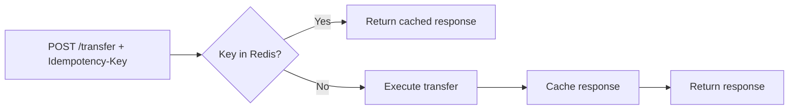
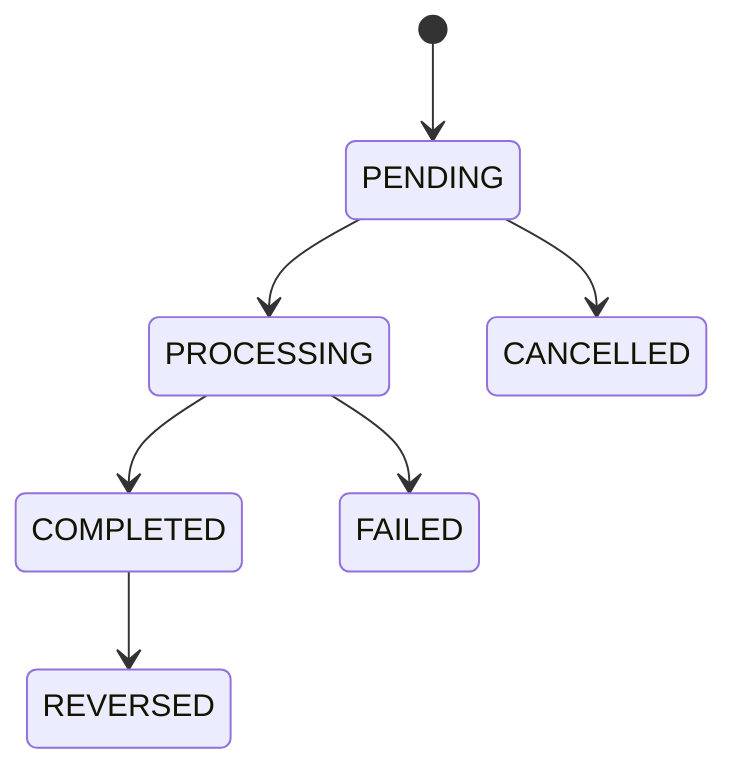

# Design Decisions

Key technical choices made in Mint, with the reasoning behind each.

---

## Polyglot Architecture

Auth and wallet are in Python (FastAPI). Everything else is NestJS (TypeScript).

**Why Python for auth and wallet?**

- Auth needs a mature ecosystem for RSA key management, JWT handling, and Alembic migrations. FastAPI + `joserfc` + SQLAlchemy is a tighter fit than the NestJS equivalents.
- Wallet exposes a gRPC server alongside a FastAPI HTTP server in the same process. Python's `grpcio` handles async gRPC servers cleanly with `asyncio`. The `grpc.aio.server` API integrates directly with FastAPI's `lifespan` hook.

**Why NestJS for everything else?**

- NestJS's dependency injection maps cleanly to microservice architecture — each module declares its own providers (Prisma, Redis, Kafka, gRPC clients) and can be tested in isolation.
- The decorator-based approach (`@GrpcMethod`, `@EventPattern`, `@MessagePattern`) makes service boundaries explicit in code.

---

## Database per Service

Each service owns exactly one PostgreSQL database with its own credentials. Services cannot connect to each other's databases.

**What this forces:**

- Cross-service data access must go through an API (gRPC or HTTP) — not a join.
- Schema changes in one service never break another service at the database level.
- Services can be migrated, replaced, or scaled independently.

**The cost:**

- Queries that would be a single join in a monolith become a network call. The admin service, for example, assembles a user profile by calling auth (gRPC) + kyc (gRPC) + wallet (gRPC) and stitching the results.

---

## When to Use gRPC vs Kafka

These two mechanisms are used for different communication patterns.

**gRPC — use when the caller needs a result before continuing**

| Caller | Callee | Why gRPC |
|--------|--------|---------|
| transactions | fraud | Must know ALLOW/BLOCK before debiting |
| transactions | kyc | Must know limit approval before debiting |
| transactions | wallet | Debit and credit are the settlement — they must succeed or fail atomically |
| admin | kyc / wallet / fraud | Admin endpoints assemble cross-service views synchronously |

**Kafka — use for fan-out side effects**

When a transfer completes, five things need to happen: analytics ingestion, notification delivery, webhook dispatch, fraud stats update, audit logging. None of these should block the HTTP response. Kafka decouples producers from consumers — the transactions service doesn't know or care how many services are listening.

```
transaction.events (COMPLETED)
  → analytics   (update monthly spend)
  → notifications (send "Transfer sent" notification)
  → webhook     (deliver to user's registered endpoints)
  → fraud       (update user transfer statistics)
  → audit       (immutable log entry)
```

The rule of thumb: **gRPC for blocking decisions, Kafka for fire-and-forget effects.**

---

## Idempotency

Every `POST /api/v1/transactions/transfer` requires an `Idempotency-Key` header. The first call executes the transfer and caches the full HTTP response in Redis for 24 hours, keyed by `{userId}:{idempotencyKey}`. Duplicate requests within 24 hours return the cached response immediately — no database writes, no fraud check, no wallet mutations.

This is implemented in `IdempotencyInterceptor` (`libs/common`), which wraps the NestJS request pipeline. The interceptor runs before the controller method and short-circuits on cache hit.



**Why this matters:** payment networks retry on timeout. Without idempotency, a network error between the client and server could cause the transfer to execute twice even though only one succeeded.

---

## Fraud Scoring

Every transaction is scored before any money moves. The fraud service runs six rules in parallel, accumulates scores, and returns a decision.

### Rules

| Rule | Fires when | Score |
|------|-----------|-------|
| `velocity_breach` | More than 3 transfers in a 5-minute window | 80 |
| `large_amount_deviation` | Amount exceeds user's mean + 3 standard deviations | 60 |
| `new_recipient` | First transfer to this recipient | 20 |
| `geo_anomaly` | IP geolocation country differs from registered country | 40 |
| `night_large` | UTC hour 00:00–04:59 AND amount > $500 | 30 |
| `sanctioned_recipient` | Recipient ID is on the sanctions list in Redis | 100 + force-block |

### Decision Thresholds

```
totalScore >= 100  OR  any rule sets forceBlock=true  →  BLOCK
totalScore >= 50                                       →  REVIEW
otherwise                                              →  ALLOW
```

`REVIEW` cases are written to the `fraudCase` table. Admins can inspect and manually approve or block them via the admin console.

### Statistical Anomaly Detection

The `large_amount_deviation` rule uses Welford's online algorithm via stored aggregates (`count`, `sumCents`, `sumSqCents` in `userTransferStats`). This lets it compute mean and variance incrementally — no scan of transaction history needed.

```
mean   = sumCents / count
E[x²]  = sumSqCents / count
stddev = sqrt(E[x²] - mean²)
threshold = mean + 3 * stddev
```

A user who always sends ~$100 will trigger the rule at ~$100.01 if variance is near zero. A user with variable amounts needs a much larger deviation to fire.

---

## Transaction State Machine

Transfers move through a formal state machine. The `StateMachineService` validates every transition and rejects invalid ones with a `400 Bad Request`.



Terminal states (`FAILED`, `CANCELLED`, `REVERSED`) have no outgoing transitions. Attempting to move a terminal transaction produces an error rather than silently doing nothing.

---

## JWT + JWKS

Auth issues RSA-signed JWTs. All other services verify tokens locally using the auth service's public key — no auth service call on every request.

**Startup flow:**

1. Each service fetches `GET /.well-known/jwks.json` from auth on startup and caches the public key.
2. Incoming requests are verified locally with the cached key via `JWTAuthGuard` (shared from `libs/common`).
3. The JWT payload includes `sub` (user ID) and `role`. Admin routes additionally check `role=ADMIN`.

**Why RSA (asymmetric) instead of a shared HMAC secret?**

With a shared secret, any service that can verify tokens can also forge them. RSA separates signing (only auth has the private key) from verification (every service has the public key). A compromised internal service cannot mint its own tokens.

---

## Audit Log Immutability

The `mint_audit` database table has a PostgreSQL trigger that fires on `BEFORE UPDATE OR DELETE` and raises an exception. No application code is needed — the constraint is enforced at the database level and cannot be bypassed by application bugs.

```sql
CREATE OR REPLACE FUNCTION prevent_audit_modification()
RETURNS TRIGGER AS $$
BEGIN
  RAISE EXCEPTION 'audit log is immutable';
END;
$$ LANGUAGE plpgsql;

CREATE TRIGGER audit_immutability
BEFORE UPDATE OR DELETE ON audit_log
FOR EACH ROW EXECUTE FUNCTION prevent_audit_modification();
```

Every Kafka event from every service lands here, keyed by `actorId`, `action`, `resourceId`, and the OpenTelemetry `traceId`. The trace ID lets you correlate an audit entry with the full distributed trace in Grafana Tempo.

---

## KYC Tier System

Users start at `UNVERIFIED`. Document submission moves them to `BASIC`. A successful Persona webhook verification or manual admin approval moves them to `VERIFIED`.

Each tier has per-transaction, daily, and monthly spend limits enforced by the kyc service via gRPC. The transactions service calls `GetLimits` before every transfer and rejects requests that would exceed the caller's tier.

```
UNVERIFIED  →  BASIC  →  VERIFIED
```

Admins can freeze a tier (no new submissions accepted, existing limits stay in force) or reject a pending submission (returns user to `UNVERIFIED`).

---

## Real-Time Notifications (SSE)

Notifications are delivered to the browser via Server-Sent Events (`GET /api/v1/notifications/stream`). Each connection registers a Redis pub/sub subscriber. When any Kafka consumer writes a new notification to the database, it also publishes the notification ID to Redis. The SSE handler receives the pub/sub message and pushes the event to the client.

```
Kafka event → NotificationService.create() → Redis PUBLISH → SSE handler → browser
```

nginx disables proxy buffering for the `/stream` endpoint so events are not held in the buffer before being forwarded to the client.

---

## Webhook Delivery

User-registered webhooks are delivered by BullMQ workers on a Redis queue. The worker attempts delivery with exponential backoff (max 5 retries). Each attempt is logged to the `deliveries` table with the HTTP status and response body.

Payloads are signed with `HMAC-SHA256` using a per-endpoint secret. Recipients can verify the `X-Mint-Signature` header to confirm the payload originated from Mint.

```
Kafka event → WebhookService → BullMQ queue → worker → POST to endpoint
                                                      ↕
                                              delivery log (status, body, attempt)
```
