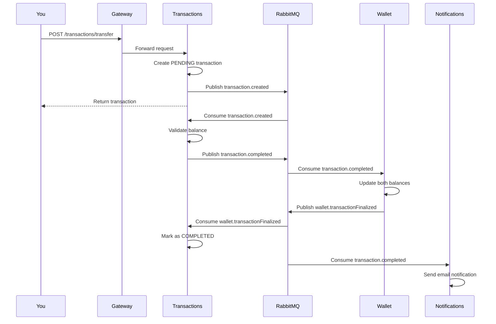

# Quick Start Guide

This guide will walk you through creating your first user and completing a transaction flow.

## Prerequisites

- Mint is [installed and running](installation.md)
- All services show as `healthy` in `docker compose ps`
- curl or similar HTTP client installed

---

## Step 1: Register a User

Create a new user account:

```bash
curl -X POST http://localhost/api/v1/auth/signup \
  -H "Content-Type: application/json" \
  -d '{
    "name": "John Doe",
    "email": "john@example.com",
    "password": "SecurePass123!"
  }'
```

**Response:**
```json
{
  "id": "507f1f77bcf86cd799439011",
  "name": "John Doe",
  "email": "john@example.com",
  "createdAt": "2025-01-15T10:30:00.000Z"
}
```

!!! success "What Happened?"
    - User account was created
    - Password was hashed with Argon2
    - `user.signup` event was published to RabbitMQ
    - Wallet was created automatically (event-driven)
    - Welcome email was sent (if SMTP is configured)

---

## Step 2: Login

Login to get an authentication cookie:

```bash
curl -X POST http://localhost/api/v1/auth/login \
  -H "Content-Type: application/json" \
  -d '{
    "email": "john@example.com",
    "password": "SecurePass123!"
  }' \
  -c cookies.txt
```

**Response:**
```json
{
  "id": "507f1f77bcf86cd799439011",
  "name": "John Doe",
  "email": "john@example.com"
}
```

!!! info "Authentication"
    The `-c cookies.txt` flag saves the HTTP-only cookie containing your JWT token. Use `-b cookies.txt` in subsequent requests to authenticate.

---

## Step 3: Get Your Wallet

Check your wallet balance:

```bash
curl http://localhost/api/v1/wallet/user \
  -b cookies.txt
```

**Response:**
```json
{
  "id": "507f1f77bcf86cd799439012",
  "userId": "507f1f77bcf86cd799439011",
  "balance": 0.00,
  "createdAt": "2025-01-15T10:30:05.000Z",
  "updatedAt": "2025-01-15T10:30:05.000Z"
}
```

!!! note
    Your wallet starts with a balance of $0.00

---

## Step 4: Top-Up Your Wallet

Add funds to your wallet:

```bash
curl -X POST http://localhost/api/v1/transactions/topup \
  -H "Content-Type: application/json" \
  -b cookies.txt \
  -d '{
    "amount": 100.00,
    "description": "Initial top-up"
  }'
```

**Response:**
```json
{
  "id": "507f1f77bcf86cd799439013",
  "type": "topup",
  "amount": 100.00,
  "description": "Initial top-up",
  "status": "pending",
  "createdAt": "2025-01-15T11:00:00.000Z"
}
```

!!! success "Transaction Flow"
    The transaction goes through these states:

    1. **PENDING** - Transaction created
    2. **PROCESSING** - Being processed by the system
    3. **COMPLETED** - Balance updated successfully

    This happens asynchronously via RabbitMQ events!

---

## Step 5: Verify Your Balance

Wait a moment for the transaction to process, then check your balance again:

```bash
curl http://localhost/api/v1/wallet/user \
  -b cookies.txt
```

**Response:**
```json
{
  "id": "507f1f77bcf86cd799439012",
  "userId": "507f1f77bcf86cd799439011",
  "balance": 100.00,
  "createdAt": "2025-01-15T10:30:05.000Z",
  "updatedAt": "2025-01-15T11:00:02.000Z"
}
```

!!! success
    Your balance is now $100.00!

---

## Step 6: Create Another User

To test transfers, create a second user:

```bash
curl -X POST http://localhost/api/v1/auth/signup \
  -H "Content-Type: application/json" \
  -d '{
    "name": "Jane Smith",
    "email": "jane@example.com",
    "password": "SecurePass123!"
  }'
```

**Save the user ID from the response:**
```json
{
  "id": "507f1f77bcf86cd799439020",  // <- Save this
  "name": "Jane Smith",
  "email": "jane@example.com"
}
```

---

## Step 7: Transfer Money

Transfer money from John to Jane:

```bash
curl -X POST http://localhost/api/v1/transactions/transfer \
  -H "Content-Type: application/json" \
  -b cookies.txt \
  -d '{
    "recipientId": "507f1f77bcf86cd799439020",
    "amount": 50.00,
    "description": "Payment for services"
  }'
```

**Response:**
```json
{
  "id": "507f1f77bcf86cd799439014",
  "type": "transfer",
  "senderId": "507f1f77bcf86cd799439011",
  "recipientId": "507f1f77bcf86cd799439020",
  "amount": 50.00,
  "description": "Payment for services",
  "status": "pending",
  "createdAt": "2025-01-15T11:15:00.000Z"
}
```

---

## Step 8: View Transaction History

List all your transactions:

```bash
curl http://localhost/api/v1/transactions \
  -b cookies.txt
```

**Response:**
```json
{
  "transactions": [
    {
      "id": "507f1f77bcf86cd799439013",
      "type": "topup",
      "amount": 100.00,
      "status": "completed",
      "description": "Initial top-up",
      "createdAt": "2025-01-15T11:00:00.000Z",
      "completedAt": "2025-01-15T11:00:02.000Z"
    },
    {
      "id": "507f1f77bcf86cd799439014",
      "type": "transfer",
      "senderId": "507f1f77bcf86cd799439011",
      "recipientId": "507f1f77bcf86cd799439020",
      "amount": 50.00,
      "status": "completed",
      "description": "Payment for services",
      "createdAt": "2025-01-15T11:15:00.000Z",
      "completedAt": "2025-01-15T11:15:02.000Z"
    }
  ],
  "total": 2
}
```

---

## Step 9: Check Final Balance

Verify your updated balance:

```bash
curl http://localhost/api/v1/wallet/user \
  -b cookies.txt
```

**Response:**
```json
{
  "balance": 50.00
}
```

!!! success "Complete!"
    You've successfully:

    - ✅ Created two users
    - ✅ Logged in
    - ✅ Topped up your wallet
    - ✅ Transferred money to another user
    - ✅ Viewed transaction history

---

## Understanding the Event Flow

Here's what happened behind the scenes during the transfer:



---

## Bonus: Monitor Events in RabbitMQ

Open the RabbitMQ Management UI to see events in real-time:

1. Go to http://localhost:15672
2. Login with `guest` / `guest`
3. Click on **Queues and Streams**
4. Watch messages flow through:
   - `wallet.update.q`
   - `email.transactionCompleted.q`
   - `transaction.created.q`

---

## Next Steps

Now that you've completed the basics:

1. [Explore the API](../api/auth.md) - Learn about all available endpoints
2. [Architecture Guide](../architecture.md) - Understand the system design
3. [Development Guide](../development.md) - Set up for local development

---

## Common Issues

### Transaction Stuck in PENDING

Wait 1-2 seconds for async processing. Check RabbitMQ logs:
```bash
docker compose logs rabbitmq
```

### 401 Unauthorized

Your session may have expired. Login again:
```bash
curl -X POST http://localhost/api/v1/auth/login \
  -H "Content-Type: application/json" \
  -d '{"email": "john@example.com", "password": "SecurePass123!"}' \
  -c cookies.txt
```

### Insufficient Balance

Ensure you have enough balance before transferring:
```bash
curl http://localhost/api/v1/wallet/user -b cookies.txt
```

For more help, see the [Troubleshooting Guide](../troubleshooting.md).
