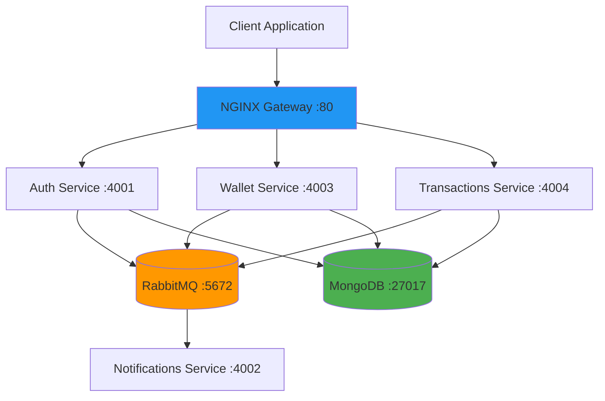

# Welcome to Mint Documentation

**A production-ready, event-driven microservices wallet system featuring secure authentication, real-time transaction processing, and automated notifications.**

  
  
  
  
  
  

---

## Overview

Mint is a **microservices-based wallet system** built with Node.js, TypeScript, and event-driven architecture using RabbitMQ. It demonstrates production-ready patterns for building scalable, distributed systems.

### Key Features

- **🔐 Secure Authentication** - JWT with RS256 asymmetric encryption
- **💰 Real-time Wallet Management** - Event-driven balance updates
- **🔁 Robust Transaction Processing** - ACID-compliant with automatic rollback
- **📨 Smart Notifications** - Email alerts for all wallet activities
- **🔗 Production API Gateway** - NGINX with rate limiting and load balancing

---

## Quick Links

-   :material-clock-fast:{ .lg .middle } __Getting Started__

    ---

    Install Mint in minutes and run your first transaction

    [:octicons-arrow-right-24: Installation Guide](getting-started/installation.md)

-   :material-book-open-page-variant:{ .lg .middle } __Architecture__

    ---

    Learn about the microservices architecture and event-driven design

    [:octicons-arrow-right-24: Architecture Overview](architecture.md)

-   :material-api:{ .lg .middle } __API Reference__

    ---

    Complete API documentation for all services

    [:octicons-arrow-right-24: API Docs](api/auth.md)

-   :material-cog:{ .lg .middle } __Development__

    ---

    Set up your local development environment

    [:octicons-arrow-right-24: Developer Guide](development.md)

---

## Architecture at a Glance

---

## Technology Stack

| Category | Technologies |
|----------|-------------|
| **Runtime** | Node.js 22.x, TypeScript 5.x |
| **Framework** | Express.js 5.x |
| **Database** | MongoDB 7.x with Mongoose |
| **Message Broker** | RabbitMQ 3.x |
| **API Gateway** | NGINX Alpine |
| **Authentication** | JWT (RS256), Argon2 |
| **Validation** | Zod |
| **Containerization** | Docker, Docker Compose |
| **Logging** | Winston, Pino |

---

## Project Highlights

### Event-Driven Architecture

All service-to-service communication happens through RabbitMQ events, ensuring:

- **Loose Coupling** - Services are independent and can be deployed separately
- **Scalability** - Easy horizontal scaling of individual services
- **Reliability** - Guaranteed message delivery with acknowledgments
- **Async Processing** - Non-blocking operations for better performance

### Security First

- **RS256 JWT Tokens** - Asymmetric encryption for enhanced security
- **JWKS Endpoint** - Public key distribution for token verification
- **HTTP-only Cookies** - Protection against XSS attacks
- **Argon2 Password Hashing** - Industry-standard password security
- **Rate Limiting** - Protection against brute force attacks

### Production Ready

- **Health Checks** - Monitor service availability
- **Error Handling** - Graceful error responses and logging
- **Docker Compose** - Simple deployment with container orchestration
- **Environment Config** - Separate configs for dev/prod environments
- **API Documentation** - Comprehensive OpenAPI-style documentation

---

## Use Cases

Mint's architecture is suitable for:

- **Portfolio Projects** - Demonstrate microservices expertise
- **Learning Platform** - Understand event-driven architecture
- **MVP Foundation** - Build fintech applications quickly
- **Interview Preparation** - Discuss system design patterns
- **Production Template** - Base for real-world wallet systems

---

## What's Next?

-   **Installation**

    Get Mint up and running in 5 minutes

    [Start Here :octicons-arrow-right-24:](getting-started/installation.md)

-   **Quick Start**

    Complete your first transaction flow

    [Try It :octicons-arrow-right-24:](getting-started/quick-start.md)

-   **API Reference**

    Explore all available endpoints

    [View APIs :octicons-arrow-right-24:](api/auth.md)

-   **Contributing**

    Help improve Mint

    [Contribute :octicons-arrow-right-24:](about/contributing.md)

---

## Support

- **GitHub Issues**: [Report bugs or request features](https://github.com/sreekarnv/mint/issues)
- **Documentation**: Browse the guides in the sidebar
- **Source Code**: [View on GitHub](https://github.com/sreekarnv/mint)

---

**Built with :heart: by [Sreekar Venkata Nutulapati](https://github.com/sreekarnv)**

[GitHub](https://github.com/sreekarnv) · [LinkedIn](https://in.linkedin.com/in/sreekar-venkata-nutulapati-63672120a)

