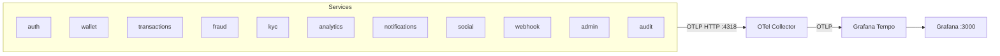

# Infrastructure

## nginx (API Gateway)

Entry point for all client traffic. Handles rate limiting and routes to services by path prefix.

**Routing**

| Path prefix | Service | Notes |
|-------------|---------|-------|
| `/api/v1/auth/login`, `/register` | auth:4001 | Rate limit: 1 req/s, burst 5 |
| `/api/v1/auth/*` | auth:4001 | Rate limit: 30 req/s |
| `/api/v1/wallet/*` | wallet:4002 | |
| `/api/v1/transactions/*` | transactions:4003 | |
| `/api/v1/kyc/*` | kyc:4004 | |
| `/api/v1/analytics/*` | analytics:4005 | |
| `/api/v1/notifications/*` | notifications:4006 | SSE: proxy buffering disabled |
| `/api/v1/social/*` | social:4007 | |
| `/api/v1/webhooks/*` | webhook:4008 | |
| `/admin/*` | admin:4009 | Internal network only in prod |
| `/health` | — | Returns 200 |

Config: `infra/nginx/nginx.conf`

---

## Kafka

Handles all async event propagation between services.

**Topics**

| Topic | Producers | Key Consumers |
|-------|-----------|---------------|
| `auth.events` | auth | wallet, kyc, notifications, audit |
| `wallet.events` | wallet | notifications, webhook, audit |
| `transaction.events` | transactions | analytics, notifications, webhook, audit |
| `kyc.events` | kyc | notifications, audit |
| `social.events` | social | transactions, notifications, audit |
| `analytics.events` | analytics | notifications, webhook |
| `webhook.events` | webhook | audit |
| `admin.events` | admin | audit |

Topics are created by the `kafka-init` container on first startup. OpenTelemetry trace context is propagated in Kafka message headers via `KafkaTraceInterceptor` so traces span async boundaries.

---

## PostgreSQL

One database per service — fully isolated credentials.

| Database | Service |
|----------|---------|
| `mint_auth` | auth |
| `mint_wallet` | wallet |
| `mint_txns` | transactions |
| `mint_fraud` | fraud |
| `mint_kyc` | kyc |
| `mint_analytics` | analytics |
| `mint_notifications` | notifications |
| `mint_social` | social |
| `mint_webhook` | webhook |
| `mint_audit` | audit |

Databases are created by `infra/postgres/init.sql` on first startup. Migrations run automatically via dedicated `*-migrate` containers:

- Auth, Wallet — Alembic (`uv run migrate`)
- All others — Prisma (`prisma migrate deploy`)

---

## Redis

| Use | Service |
|-----|---------|
| Idempotency cache (24 h TTL per `Idempotency-Key`) | transactions |
| BullMQ job queue (money request expiry) | social |
| BullMQ job queue (webhook delivery + retry) | webhook |

---

## MinIO (Object Storage)

S3-compatible object store for KYC document uploads.

- **Bucket:** `mint-kyc-docs`
- **Console:** `http://localhost:9001` (dev)
- Bucket is created automatically by the `minio-init` container.
- For production with AWS S3, remove the MinIO service and set `S3_ENDPOINT`, `S3_ACCESS_KEY`, `S3_SECRET_KEY`.

---

## Observability

Traces flow from an HTTP request at nginx, through synchronous gRPC calls, and into async Kafka consumers — all as a single distributed trace.

**What's instrumented in every service:**

- Incoming HTTP requests
- Outgoing HTTP calls
- Database queries (SQLAlchemy / Prisma)
- gRPC calls (client and server)
- Kafka publish and consume

**Trace propagation across async boundaries:**

| Boundary | Mechanism |
|----------|-----------|
| HTTP | W3C Trace Context headers |
| Kafka | `KafkaTraceInterceptor` writes/reads trace headers on messages |
| gRPC | gRPC metadata |

---

## MailHog (Dev Email)

Catches all outbound SMTP in development. No real emails are sent.

- **SMTP:** `mailhog:1025`
- **Web UI:** `http://localhost:8025`
- Used by: auth (email verification), notifications (email alerts)
