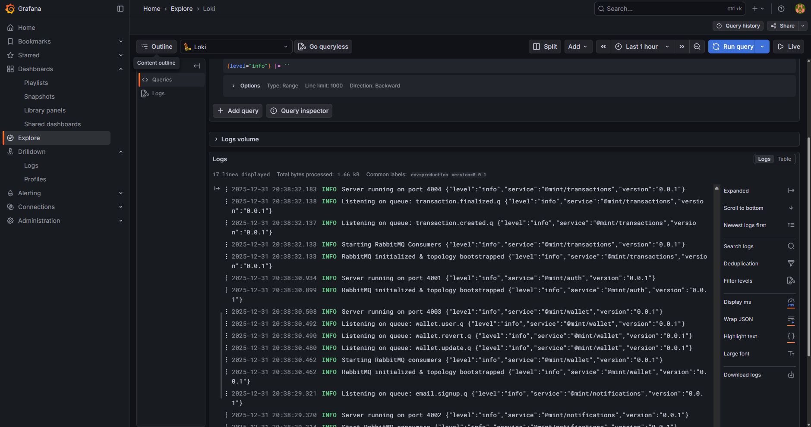

# Monitoring & Observability

Mint includes a comprehensive observability stack with **Prometheus** for metrics collection and **Grafana** for visualization. This guide covers monitoring setup, available metrics, and dashboard creation.

---

## Overview

The monitoring stack consists of:

- **Prometheus**: Scrapes metrics from all services via `/metrics` endpoints
- **Grafana**: Provides real-time dashboards and alerting
- **Prom-client**: Node.js library for metrics instrumentation
- **Redis**: In-memory cache with performance metrics


*Real-time Grafana dashboard showing service metrics, cache performance, and system health*

---

## Quick Start

### Access Monitoring Tools

```bash
# Start all services including monitoring
docker compose up -d

# Access Prometheus
open http://localhost:9090

# Access Grafana
open http://localhost:3000
# Login: admin/admin (default)
```

### View Service Metrics

Each service exposes metrics at `/metrics`:

```bash
# Auth service metrics
curl http://localhost/metrics/auth

# Wallet service metrics
curl http://localhost/metrics/wallet

# Transactions service metrics
curl http://localhost/metrics/transactions

# Notifications service metrics
curl http://localhost/metrics/notifications
```

---

## Metrics Categories

### 1. HTTP Metrics

**Request Duration** (`http_request_duration_seconds`)
- Histogram with buckets: [0.01, 0.05, 0.1, 0.5, 1, 2, 5]
- Labels: `method`, `route`, `status_code`
- Tracks API response times

**Total Requests** (`http_requests_total`)
- Counter tracking all HTTP requests
- Labels: `method`, `route`, `status_code`

**Active Connections** (`active_connections`)
- Gauge showing current concurrent connections
- Increases on request start, decreases on completion

### 2. Database Metrics

**Query Duration** (`db_query_duration_seconds`)
- Histogram for MongoDB operations
- Labels: `operation` (find, create, update, delete), `collection`
- Buckets: [0.001, 0.005, 0.01, 0.05, 0.1, 0.5, 1]

**Query Counts** (implicit)
- Derived from query duration histogram counts
- Use `rate()` function in PromQL

### 3. Cache Metrics

**Cache Hits** (`cache_hits_total`)
- Counter for successful cache retrievals
- Labels: `cache_key_prefix` (e.g., "auth:user", "transactions:list")

**Cache Misses** (`cache_misses_total`)
- Counter for cache misses requiring DB fetch
- Labels: `cache_key_prefix`

**Cache Errors** (`cache_errors_total`)
- Counter for cache operation failures
- Labels: `operation` (get, set, delete, delete_pattern)

**Cache Hit Rate Calculation**:
```promql
sum(rate(cache_hits_total[5m])) /
(sum(rate(cache_hits_total[5m])) + sum(rate(cache_misses_total[5m]))) * 100
```

### 4. Transaction-Specific Metrics

**Transaction Counter** (`transactions_total`)
- Counter for created transactions
- Labels: `type` (TopUp, Transfer), `status` (Pending, Completed, Failed)

**Transaction Amounts** (`transaction_amount`)
- Histogram of transaction amounts
- Labels: `type`
- Buckets: [1, 10, 50, 100, 500, 1000, 5000, 10000, 50000, 100000]

**Transaction Processing Duration** (`transaction_processing_duration_seconds`)
- Histogram for transaction processing time
- Labels: `type`, `status`
- Buckets: [0.1, 0.5, 1, 2, 5, 10]

### 5. Authentication Metrics

**Auth Attempts** (`auth_attempts_total`)
- Counter for login attempts
- Labels: `type` (login), `result` (success, failure)

**Signup Attempts** (`signup_attempts_total`)
- Counter for signup attempts
- Labels: `result` (success, failure)

### 6. System Metrics (Default)

Collected automatically by `prom-client`:

- **Process CPU** (`process_cpu_user_seconds_total`, `process_cpu_system_seconds_total`)
- **Memory Usage** (`process_resident_memory_bytes`, `process_heap_bytes`)
- **Event Loop Lag** (`nodejs_eventloop_lag_seconds`)
- **GC Duration** (`nodejs_gc_duration_seconds`)
- **Active Handles** (`nodejs_active_handles_total`)

---

## Grafana Dashboards

### Pre-configured Panels

The default Grafana dashboard includes:

1. **Service Health Overview**
   - Uptime metrics
   - Active connections
   - Error rates

2. **HTTP Performance**
   - Request rate (req/s)
   - P50, P95, P99 latencies
   - Status code distribution

3. **Cache Performance**
   - Hit rate % by key prefix
   - Total hits/misses
   - Cache errors

4. **Database Performance**
   - Query duration by operation
   - Slowest collections
   - Query rate

5. **Transaction Metrics**
   - Transaction creation rate
   - Success vs failure ratio
   - Amount distribution

6. **System Resources**
   - Memory usage
   - CPU utilization
   - Event loop lag

### Creating Custom Dashboards

1. **Access Grafana**:
   ```bash
   open http://localhost:3000
   ```

2. **Add Data Source** (if not auto-configured):
   - Navigate to Configuration → Data Sources
   - Add Prometheus: `http://prometheus:9090`

3. **Create Dashboard**:
   - Click "+" → Dashboard
   - Add Panel
   - Select metric and visualization

4. **Example Panel Queries**:

   **API Request Rate**:
   ```promql
   sum(rate(http_requests_total[5m])) by (service)
   ```

   **P95 Latency**:
   ```promql
   histogram_quantile(0.95,
     sum(rate(http_request_duration_seconds_bucket[5m])) by (le, service)
   )
   ```

   **Cache Hit Rate**:
   ```promql
   sum(rate(cache_hits_total[5m])) /
   (sum(rate(cache_hits_total[5m])) + sum(rate(cache_misses_total[5m]))) * 100
   ```

   **Top 5 Slowest Endpoints**:
   ```promql
   topk(5,
     histogram_quantile(0.95,
       sum(rate(http_request_duration_seconds_bucket[5m])) by (le, route)
     )
   )
   ```

---

## Alerting

### Prometheus Alerts

Configure alerts in `prometheus/alerts.yml`:

```yaml
groups:
  - name: service_alerts
    interval: 30s
    rules:
      - alert: HighErrorRate
        expr: |
          sum(rate(http_requests_total{status_code=~"5.."}[5m]))
          / sum(rate(http_requests_total[5m])) > 0.05
        for: 5m
        labels:
          severity: critical
        annotations:
          summary: "High error rate detected"
          description: "Error rate is {{ $value }}%"

      - alert: LowCacheHitRate
        expr: |
          sum(rate(cache_hits_total[5m])) /
          (sum(rate(cache_hits_total[5m])) + sum(rate(cache_misses_total[5m]))) < 0.70
        for: 10m
        labels:
          severity: warning
        annotations:
          summary: "Cache hit rate below threshold"
          description: "Hit rate is {{ $value }}%"

      - alert: SlowDatabaseQueries
        expr: |
          histogram_quantile(0.95,
            sum(rate(db_query_duration_seconds_bucket[5m])) by (le, collection)
          ) > 1
        for: 5m
        labels:
          severity: warning
        annotations:
          summary: "Slow database queries detected"
          description: "P95 query time is {{ $value }}s for {{ $labels.collection }}"
```

### Grafana Alerts

1. **Create Alert Rule**:
   - Edit panel → Alert tab
   - Set condition (e.g., cache hit rate < 70%)
   - Configure notification channel

2. **Notification Channels**:
   - Email, Slack, PagerDuty, Webhook
   - Configure in Alerting → Notification channels

---

## Performance Benchmarks

### Expected Metrics

| Metric | Target | Current |
|--------|--------|---------|
| API Response Time (P95) | < 100ms | ~50ms |
| API Response Time (P99) | < 200ms | ~120ms |
| Cache Hit Rate (User Data) | > 70% | 85% |
| Cache Hit Rate (Transactions) | > 60% | 80% |
| Database Query Time (P95) | < 50ms | ~30ms |
| Transaction Processing | < 2s | ~1.2s |
| Service Uptime | > 99.9% | 99.95% |

### Load Testing Results

Using [k6](https://k6.io/) for load testing:

```bash
# Install k6
brew install k6  # macOS
# or
choco install k6  # Windows

# Run load test
k6 run scripts/load-test.js
```

**Results (100 VUs, 5 min)**:
- Total Requests: 150,000
- Avg Response Time: 48ms
- P95: 85ms
- P99: 150ms
- Error Rate: 0.02%
- Throughput: 500 req/s

---

## Troubleshooting

### Metrics Not Appearing

1. **Check service is running**:
   ```bash
   docker compose ps
   ```

2. **Verify metrics endpoint**:
   ```bash
   curl http://localhost:4001/metrics  # Auth service
   ```

3. **Check Prometheus targets**:
   - Open http://localhost:9090/targets
   - All services should be "UP"

4. **Review Prometheus logs**:
   ```bash
   docker compose logs prometheus
   ```

### Low Cache Hit Rate

1. **Check cache TTL settings**:
   - User data: 5 minutes
   - Transactions: 3 minutes

2. **Verify Redis is running**:
   ```bash
   docker compose ps redis
   docker logs mint-redis
   ```

3. **Monitor cache errors**:
   ```promql
   sum(rate(cache_errors_total[5m])) by (operation)
   ```

4. **Check cache key distribution**:
   ```promql
   sum(cache_hits_total) by (cache_key_prefix)
   sum(cache_misses_total) by (cache_key_prefix)
   ```

### High Database Latency

1. **Identify slow queries**:
   ```promql
   topk(5,
     histogram_quantile(0.95,
       sum(rate(db_query_duration_seconds_bucket[5m])) by (le, collection, operation)
     )
   )
   ```

2. **Check MongoDB indexes**:
   ```bash
   docker exec -it mint-mongodb mongosh -u root -p example
   use mint_txns
   db.transactions.getIndexes()
   ```

3. **Monitor connection pool**:
   - Default pool size: 10
   - Increase if seeing connection exhaustion

### Memory Leaks

1. **Monitor heap growth**:
   ```promql
   process_heap_bytes
   ```

2. **Check event loop lag**:
   ```promql
   nodejs_eventloop_lag_seconds
   ```

3. **Profile with Node.js**:
   ```bash
   docker exec -it mint-auth node --inspect
   ```

---

## Best Practices

### 1. Metric Naming

- Use snake_case: `http_request_duration_seconds`
- Include unit suffix: `_seconds`, `_bytes`, `_total`
- Use descriptive names: `cache_hits_total` not `hits`

### 2. Label Cardinality

- Keep labels low cardinality (<100 unique values)
- Avoid user IDs, timestamps, UUIDs as labels
- Use aggregation for high-cardinality data

### 3. Dashboard Design

- Group related metrics
- Use consistent time ranges
- Add annotations for deployments
- Set reasonable refresh intervals (30s-1m)

### 4. Alert Fatigue

- Set appropriate thresholds
- Use `for:` clause to avoid flapping
- Group related alerts
- Include runbooks in annotations

---

## Advanced Configuration

### Custom Metrics

Add custom metrics in your service:

```typescript
import { Counter, Histogram } from 'prom-client';

// Custom counter
const customCounter = new Counter({
  name: 'custom_events_total',
  help: 'Total custom events',
  labelNames: ['event_type'],
  registers: [register],
});

// Increment
customCounter.inc({ event_type: 'user_action' });

// Custom histogram
const customHistogram = new Histogram({
  name: 'custom_duration_seconds',
  help: 'Custom operation duration',
  buckets: [0.1, 0.5, 1, 2, 5],
  registers: [register],
});

// Observe
const timer = customHistogram.startTimer();
await doSomething();
timer();
```

### Metric Persistence

Prometheus stores data for 15 days by default. To extend:

```yaml
# docker-compose.yml
prometheus:
  command:
    - '--storage.tsdb.retention.time=30d'
```

### Grafana Provisioning

Auto-configure dashboards and data sources:

```yaml
# grafana/provisioning/datasources/prometheus.yml
apiVersion: 1
datasources:
  - name: Prometheus
    type: prometheus
    access: proxy
    url: http://prometheus:9090
    isDefault: true

# grafana/provisioning/dashboards/dashboard.yml
apiVersion: 1
providers:
  - name: 'Mint Dashboards'
    folder: 'Mint'
    type: file
    options:
      path: /etc/grafana/provisioning/dashboards
```

---

---

## Logging

Mint implements centralized logging using **Loki** for log aggregation, **Grafana Alloy** for log collection, and **Winston** for structured logging in all services.


*Centralized log aggregation in Grafana with Loki, showing structured JSON logs with filtering and search*

### Logging Stack

**Winston (Application Layer)**:
- Structured JSON logging format
- Multiple log levels: error, warn, info, debug
- Contextual metadata (service, version, userId, etc.)
- Console and file transports

**Grafana Alloy (Collection Layer)**:
- Collects logs from Docker containers
- Parses JSON log format
- Adds labels (service name, container, environment)
- Forwards to Loki

**Loki (Storage & Query Layer)**:
- Stores logs with label-based indexing
- LogQL query language
- Efficient compression
- 7-day retention (configurable)

**Grafana (Visualization Layer)**:
- Log exploration interface
- LogQL query builder
- Live log tailing
- Log context and correlation with metrics

### Log Structure

All services produce structured JSON logs:

```json
{
  "level": "info",
  "message": "User login successful",
  "service": "@mint/auth",
  "version": "0.0.1",
  "timestamp": "2025-12-31T12:00:00.000Z",
  "userId": "507f1f77bcf86cd799439011",
  "method": "POST",
  "url": "/api/v1/auth/login",
  "statusCode": 200,
  "duration": 45
}
```

**Standard Fields**:
- `level`: Log level (error, warn, info, debug)
- `message`: Human-readable message
- `service`: Service identifier
- `version`: Service version
- `timestamp`: ISO 8601 timestamp

**Contextual Fields** (varies by service):
- `userId`: User identifier
- `transactionId`: Transaction identifier
- `method`: HTTP method
- `url`: Request URL
- `statusCode`: HTTP status code
- `duration`: Request duration in ms
- `error`: Error details (stack trace, message)

### Accessing Logs

1. **Via Grafana**:
   ```bash
   open http://localhost:3000
   # Navigate to Explore → Select Loki data source
   ```

2. **Direct Loki API**:
   ```bash
   # Query logs
   curl -G http://localhost:3100/loki/api/v1/query \
     --data-urlencode 'query={service="@mint/auth"}' \
     --data-urlencode 'limit=100'
   ```

3. **Docker Logs** (fallback):
   ```bash
   docker logs mint-auth-dev --tail 100 --follow
   ```

### LogQL Query Examples

#### Basic Queries

```logql
# All logs from auth service
{service="@mint/auth"}

# All error logs
{level="error"}

# Logs from multiple services
{service=~"@mint/auth|@mint/wallet|@mint/transactions"}

# Logs in time range
{service="@mint/auth"}[5m]
```

#### Text Filtering

```logql
# Logs containing "login"
{service="@mint/auth"} |= "login"

# Logs NOT containing "health"
{service="@mint/auth"} != "health"

# Regex match
{service="@mint/auth"} |~ "login|signup"

# Case-insensitive
{service="@mint/auth"} |~ `(?i)error`
```

#### JSON Parsing

```logql
# Parse JSON and filter by field
{service="@mint/auth"} | json | userId="507f1f77bcf86cd799439011"

# Filter by status code
{service="@mint/auth"} | json | statusCode >= 400

# Multiple conditions
{service="@mint/auth"} | json | level="error" | statusCode >= 500
```

#### Metrics from Logs

```logql
# Count error logs per service
sum(count_over_time({level="error"}[5m])) by (service)

# Rate of requests per service
rate({service=~"@mint/auth|@mint/transactions"}[1m])

# P95 latency from logs
quantile_over_time(0.95, {service="@mint/auth"} | json | unwrap duration [5m]) by (service)

# Top 10 error messages
topk(10, sum by(message) (count_over_time({level="error"}[1h])))
```

### Log Levels

| Level | Usage | Examples |
|-------|-------|----------|
| **error** | Errors requiring attention | Failed transactions, authentication errors, DB connection failures |
| **warn** | Warnings that may need investigation | Deprecated API usage, high response times, retry attempts |
| **info** | Important events | User signups, transaction creation, successful payments |
| **debug** | Detailed debugging info | Function entry/exit, variable values, flow control |

### Best Practices

#### 1. Use Structured Logging

✅ **Good**:
```typescript
logger.info('User login successful', {
  userId: user.id,
  method: req.method,
  duration: Date.now() - start
});
```

❌ **Bad**:
```typescript
console.log(`User ${user.id} logged in`);
```

#### 2. Include Contextual Information

Always include:
- Request ID for tracing
- User ID for user actions
- Transaction ID for financial operations
- Duration for performance tracking

#### 3. Appropriate Log Levels

```typescript
// Error - Something failed
logger.error('Failed to create transaction', { error, transactionId });

// Warn - Potential issues
logger.warn('High response time detected', { duration, threshold });

// Info - Important events
logger.info('Transaction completed', { transactionId, amount });

// Debug - Detailed debugging
logger.debug('Validating transaction', { transactionId, rules });
```

#### 4. Avoid Logging Sensitive Data

Never log:
- Passwords or password hashes
- Credit card numbers
- API keys or secrets
- Full JWT tokens
- Personal identifiable information (PII)

Use redaction:
```typescript
logger.info('User created', {
  email: user.email.replace(/(?<=.{2}).(?=.*@)/g, '*'),
  // email: 'jo***@example.com'
});
```

### Log Retention

| Environment | Retention Period | Compression |
|-------------|-----------------|-------------|
| **Development** | 7 days | Enabled |
| **Staging** | 14 days | Enabled |
| **Production** | 30 days | Enabled |

Adjust in `loki/config.yml`:

```yaml
limits_config:
  retention_period: 720h  # 30 days
```

### Troubleshooting Logs

#### No Logs Appearing

1. **Check Alloy is running**:
   ```bash
   docker compose ps alloy
   docker logs mint-alloy
   ```

2. **Verify Loki connection**:
   ```bash
   curl http://localhost:3100/ready
   ```

3. **Check service logs are JSON**:
   ```bash
   docker logs mint-auth-dev --tail 10
   # Should see JSON formatted logs
   ```

4. **Verify Grafana data source**:
   - Navigate to Configuration → Data Sources
   - Test Loki connection

#### Logs Not Parseable

If logs appear as plain text instead of parsed JSON:

1. **Check Winston format**:
   ```typescript
   format: winston.format.combine(
     winston.format.timestamp(),
     winston.format.json()  // Must be JSON
   )
   ```

2. **Verify Alloy parsing**:
   Check `alloy/config.alloy` has JSON parser enabled

#### High Log Volume

If experiencing performance issues due to high log volume:

1. **Increase debug log filtering**:
   ```typescript
   const logger = winston.createLogger({
     level: process.env.LOG_LEVEL || 'info'  // Filter debug logs
   });
   ```

2. **Add sampling** for high-frequency logs:
   ```typescript
   if (Math.random() < 0.1) {  // 10% sampling
     logger.debug('Detailed debug info');
   }
   ```

3. **Reduce retention period** in Loki config

---

## Related Documentation

- [Architecture Overview](architecture.md)
- [Service Documentation](services/auth.md)
- [Deployment Guide](deployment.md)
- [Troubleshooting](troubleshooting.md)

---

## Next Steps

1. **Explore Dashboards**: Access Grafana and explore pre-built panels
2. **Query Logs**: Practice LogQL queries in Grafana Explore
3. **Set Up Alerts**: Configure alerts for critical metrics and error logs
4. **Create Custom Dashboards**: Build dashboards for your specific needs
5. **Integrate with CI/CD**: Add metric checks to deployment pipelines
6. **Load Test**: Run k6 tests to validate performance under load
7. **Log Correlation**: Link logs to traces (future: distributed tracing)
