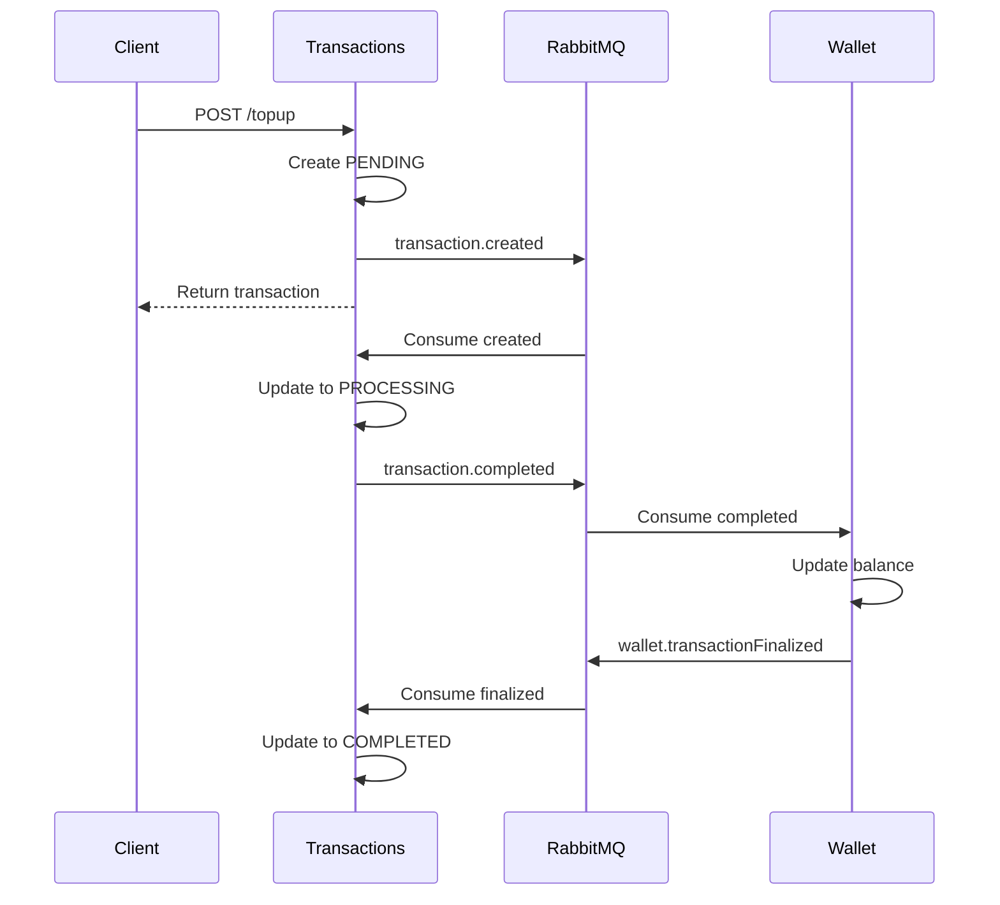
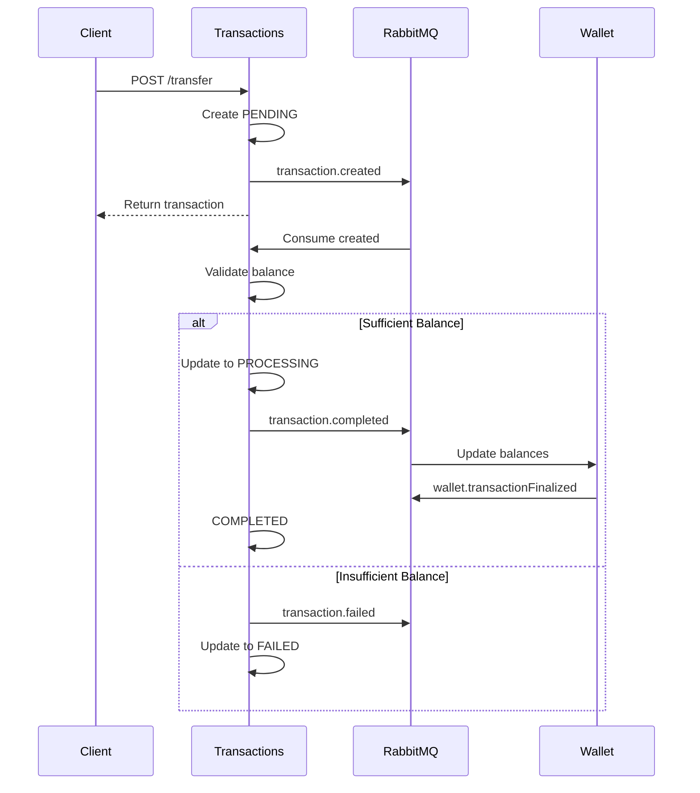

# Transactions Service

The **Transactions Service** orchestrates all financial transactions between users with event-driven processing.

## Overview

- **Port**: 4004
- **Database**: `mint_txns` (MongoDB)
- **Events Published**: `transaction.created`, `transaction.completed`, `transaction.failed`
- **Events Consumed**: `transaction.created`, `wallet.transactionFinalized`

## Features

### Transaction Types
- **Top-up**: Add funds to wallet
- **Transfer**: Send money to other users

### Transaction Lifecycle
- State management: PENDING → PROCESSING → COMPLETED/FAILED
- Event-driven workflow
- Automatic rollback on failures
- Idempotency support

### Validation
- Balance verification for transfers
- User existence checks
- Amount validation

## Technology Stack

- **Express.js** - Web framework
- **MongoDB/Mongoose** - Database ORM
- **RabbitMQ** - Event consumption & publishing
- **Zod** - Request validation
- **Jose** - JWT verification

## Key Endpoints

For detailed API documentation, see [Transactions API Reference](../api/transactions.md).

| Endpoint | Method | Description | Auth Required |
|----------|--------|-------------|---------------|
| `/api/v1/transactions` | GET | List all transactions | Yes |
| `/api/v1/transactions/:id` | GET | Get transaction details | Yes |
| `/api/v1/transactions/topup` | POST | Add funds to wallet | Yes |
| `/api/v1/transactions/transfer` | POST | Transfer funds | Yes |

## Transaction States

| State | Description |
|-------|-------------|
| `PENDING` | Transaction created, awaiting processing |
| `PROCESSING` | Transaction is being processed |
| `COMPLETED` | Transaction successfully completed |
| `FAILED` | Transaction failed (insufficient balance, errors) |

## Event Flow

### Top-Up Flow



### Transfer Flow



## Event Publishing

### transaction.created

Published when a transaction is created.

**Routing Key**: `transaction.created`

**Payload**:
```json
{
  "transactionId": "507f1f77bcf86cd799439013",
  "type": "transfer",
  "senderId": "507f1f77bcf86cd799439011",
  "recipientId": "507f1f77bcf86cd799439020",
  "amount": 50.00
}
```

### transaction.completed

Published when a transaction is successfully processed.

**Routing Key**: `transaction.completed`

**Consumers**:
- **Wallet Service** - Updates balances
- **Notifications Service** - Sends success email

### transaction.failed

Published when a transaction fails.

**Routing Key**: `transaction.failed`

**Consumers**:
- **Wallet Service** - Reverts changes
- **Notifications Service** - Sends failure email

## Event Consumption

### transaction.created

Processes the transaction and validates requirements.

**Action**: Validate and update state to PROCESSING or FAILED

### wallet.transactionFinalized

Finalizes the transaction after wallet updates.

**Action**: Update state to COMPLETED

## Database Schema

### Transaction Model

```typescript
{
  type: 'topup' | 'transfer',
  senderId: ObjectId,
  recipientId: ObjectId,      // Only for transfers
  amount: Number,
  description: String,
  status: 'pending' | 'processing' | 'completed' | 'failed',
  createdAt: Date,
  completedAt: Date,
  failedAt: Date
}
```

**Indexes**:
- `senderId`
- `recipientId`
- `type`
- `status`

## Validation Rules

### Top-Up
- Amount must be positive
- Amount must be a number

### Transfer
- Amount must be positive
- Sender must have sufficient balance
- Recipient must exist
- Cannot transfer to self

## Configuration

See [Configuration Guide](../getting-started/configuration.md#transactions-service-configuration) for environment variables.

## Related Documentation

- [Transactions API Reference](../api/transactions.md)
- [Event Architecture](../events.md)
- [Wallet Service](wallet.md)
